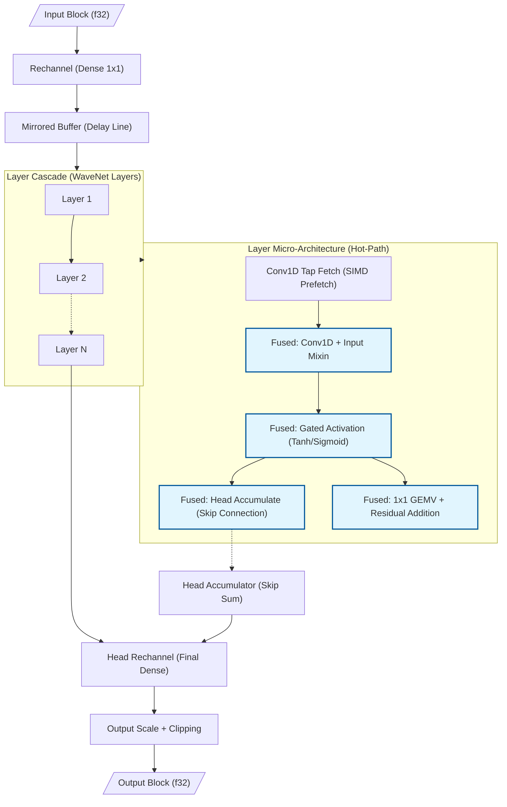
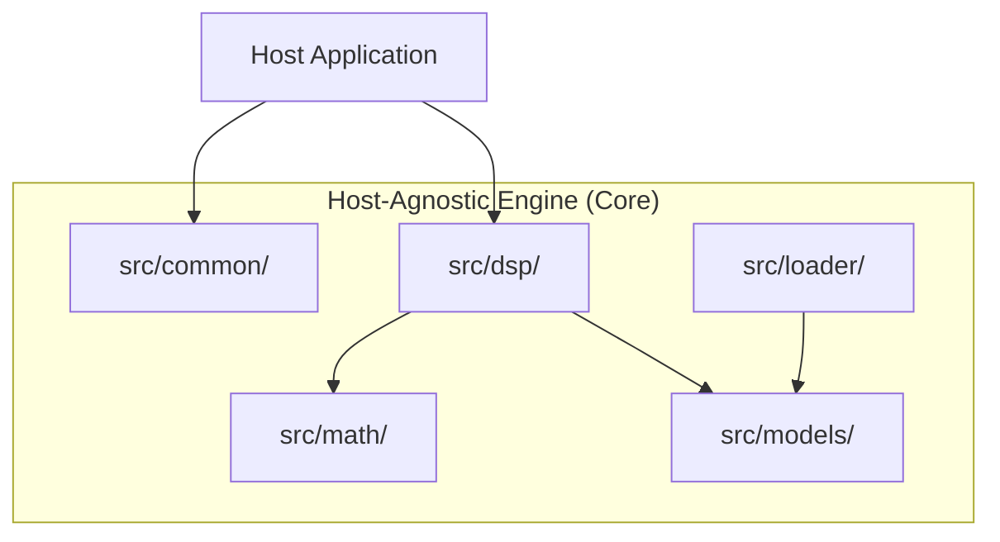
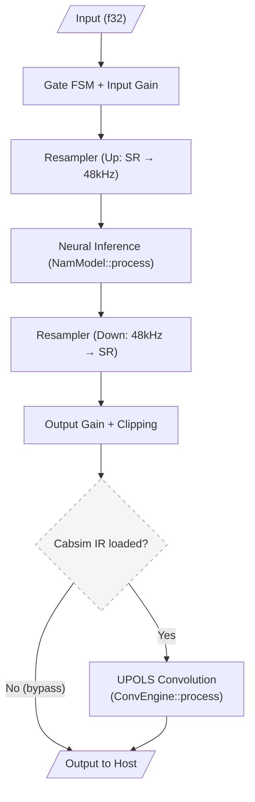

<!--
SPDX-License-Identifier: Apache-2.0
Copyright (c) 2026 Fábio Henrique de Lima Silva (fhl.bsb@gmail.com) All rights reserved.
-->

# NAM-rs Architecture: Neural Inference Engine

This is the general architecture reference for the NeuralAmpModeler-rs DSP engine: model dispatch, SIMD microarchitecture, pipeline layout, and cross-cutting design decisions. For domain-specific detail, see the pointers in each section and [docs/](.) as a whole — this file intentionally does not repeat content that already has a dedicated home (fidelity trade-offs, host integration details, testing methodology, NAMB byte layout, etc.).

NeuralAmpModeler-rs is a host-agnostic DSP core engineered for low-latency neural inference of audio equipment simulations (Neural Amp Modeler), in idiomatic Rust with a focus on RT (Real-Time) safety. It is designed to be embedded as an `rlib` dependency in interactive applications, offline renderers, analysis tools, and embedded pipelines.

## Public-library boundary

The engine is an independent public library. Downstream applications may exercise and validate it, but they do not define or own its architecture. Public APIs, diagnostics, policies, and quality contracts must express reusable engine concepts rather than the lifecycle, naming, parameter IDs, or transport details of a particular consumer, backend, or plugin format. Consumer-specific adapters belong downstream.

## 1. Inference Engine Architecture

### 1.1 Structural Dispatch: `StaticModel` Enum (Zero Vtable Routing)

NeuralAmpModeler-rs uses a **static enum dispatch** pattern to route inference calls to the correct model architecture without virtual table (vtable) overhead. The `StaticModel` enum (`src/models/mod.rs`) has 23 variants covering all supported architectures:

| Family                 | Variants                                                                                                            | Dispatch Strategy                  |
|:---------------------- |:------------------------------------------------------------------------------------------------------------------- |:---------------------------------- |
| **WaveNet A1**         | `WavenetStandard` (ch=16), `WavenetLite` (ch=12), `WavenetFeather` (ch=8), `WavenetNano` (ch=4)                     | Const-generic monomorphization     |
| **WaveNet A2**         | `WavenetA2Full` (ch=8), `WavenetA2Lite` (ch=3)                                                                      | Const-generic monomorphization     |
| **WaveNet A2 Dyn**     | `WavenetA2Dyn`                                                                                                      | Runtime dimensions (free channels) |
| **WaveNet A2 Cascade** | `WavenetA2Cascade`                                                                                                  | Multi-array dynamic cascade        |
| **WaveNet Dyn**        | `WavenetDyn` (backed by `WaveNetModelDyn`)                                                                          | Free geometry fallback             |
| **LSTM Static**        | `Lstm1x3`, `Lstm1x8`, `Lstm1x12`, `Lstm1x16`, `Lstm1x24`, `Lstm2x8`, `Lstm2x12`, `Lstm2x16`, `Lstm1x40`, `Lstm2x24` | Const-generic monomorphization     |
| **LSTM Dyn**           | `LstmDyn` (backed by `LstmModelDyn`)                                                                                | Runtime dimensions fallback        |
| **Container**          | `Container` (backed by `ContainerModel`)                                                                            | Nested `StaticModel` dispatch      |
| **ConvNet**            | `ConvNet` (backed by `ConvNetModel`)                                                                                | Layer-chain SIMD dispatch          |
| **Linear**             | `Linear` (backed by `LinearModel`)                                                                                  | Direct SIMD FIR / Partitioned FFT  |

The `NamModel::process()` implementation uses a flat `match self` on all 23 variants and directly calls the inner model's method (`src/models/static_model.rs`). With `#[inline(always)]`, the compiler produces a jump table at each call site — the CPU branch predictor learns the active model type within a few blocks, achieving **zero dispatch overhead** in the steady state, equivalent to a direct function call.

#### Dynamic Models: Free-Shape Fallback

For models whose geometry does not match any of the const-generic profiles, the loader routes to one of three dynamic variants:

- **`WaveNetModelDyn`** (`src/models/wavenet/model_dyn.rs`): Activated when `get_wavenet_topology()` returns `Free(geometry)` — handling arbitrary `channels`, `head`, `condition_size`, and `post_stack_head` dimensions. Supports optional `condition_dsp` (a nested `StaticModel` sub-model that pre-processes raw audio, mirroring C++ `model.cpp:692-722`).
- **`LstmModelDyn`** (`src/models/lstm/model_dyn.rs`): Activated when the `(num_layers, hidden_size)` pair does not match any of the 10 static LSTM profiles. Supports arbitrary layer counts and hidden sizes. Inference is the AVX2 (`x86-64-v3`) kernel only — there is no `process_avx512` on this type.
- **`WaveNetA2Dyn`** (`src/models/a2/model/dynamic/mod.rs`): Activated for models matching the A2 23-layer pattern with channel counts other than 3 or 8. Uses runtime-dimensioned conv1d and GEMV kernels.
- **`WaveNetA2Cascade`** (`src/models/a2/model/cascade/mod.rs`): Activated for multi-array A2 models, serializing multiple `WaveNetA2Dyn` instances into a sequential pipeline.

These dynamic paths use heap-allocated `Vec`-based arrays for weights and states instead of stack-allocated const-generic arrays. While they introduce a one-time allocation at load time, the hot inference path remains **zero-allocation** and **RT-safe** via the same `match self` dispatch as const-generic variants.

### 1.2 SIMD Architecture & Dispatch Policy (x86-64-v3 Baseline)

NeuralAmpModeler-rs enforces an explicit, deterministic SIMD policy tailored for predictable real-time DSP execution:

1. **Mandatory Baseline (`x86-64-v3`) & Manual Vectorization:**
   - The crate decrees `x86-64-v3` (AVX2, FMA, BMI1, BMI2, F16C, LZCNT, MOVBE) as its mandatory compile-time baseline (enforced via `.cargo/config.toml` and compile-time assertions in `src/lib.rs`). Compiled artifacts target `x86-64-v3` directly.
   - All performance-critical kernels rely on explicit, hand-written SIMD intrinsics and const-generic layout monomorphization rather than relying on unpredictable compiler auto-vectorization.

2. **Dispatch Engine (kept) vs. AVX-512 Promotion (not justified):**
   - The portable engine is the `SimdMath` trait plus the `dispatch_simd!` macro ([`src/math/common/mod.rs`](../src/math/common/mod.rs)): a static `match` on `effective_instruction_set()`, zero vtables, zero function pointers on the audio thread. `Avx512VnniBf16` is deprecated and folds into `Avx512Math` (`f32`). A possible future ARM/NEON (or SVE) backend is a new `SimdMath` impl behind that same match — it does **not** require shipping AVX-512 kernels.
   - There is no scalar fallback on the x86 audio hot path. Off-RT, `build_model` queries `avx2` and `fma` and returns `E5001 UNSUPPORTED_CPU_ARCHITECTURE` instead of `SIGILL` on a pre-v3 CPU. That check must not appear in `NamModel::process()`.
   - **Product policy:** AVX2 (`x86-64-v3`) is the only production backend. AVX-512 / VL256 / BF16 / VNNI / AMX are **not** promoted. The ≥12% `process()` N=64 gate failed on the remote receipt (see §4).
   - **Retention & isolation strategy:** the dispatch engine and AVX-512/VL256 sources are retained in-tree strictly as research/test artefacts (for re-measurement, `TEST_ISA_OVERRIDE`, and `utils/remote-simd-gate.sh`). They are gated behind the optional, opt-in `avx512` Cargo feature.
   - **Production dispatch status:** `detect_best_simd()` resolves to `InstructionSet::Avx2` in default builds. Under the opt-in `avx512` feature it resolves to `Avx512` only when the host supports the **full `F+VL+BW+DQ` capability matrix** (`avx512f` + `avx512vl` + `avx512bw` + `avx512dq`); any partial subset (e.g. F+VL without BW/DQ, common in VMs/hypervisors) falls back to AVX2 — never a `SIGILL` (T2.1/F-ROB-03). The `dispatch_simd!` macro monomorphizes only `Avx2Math` in default builds, eliminating all AVX-512 kernels and EVEX/ZMM opcodes from the default release `.text` segment. AVX-512 monomorphization is compiled only when `--features avx512` is explicitly supplied at build time for research and benchmarking.

3. **AVX-512 ROI Policy & Decision Boundaries (Process Gate $\ge 12\%$):**
   - An AVX-512 path is merged into *active production dispatch* only if it demonstrates a measured throughput speedup of **$\ge 12\%$** in full, end-to-end `NamModel::process()` execution ($p < 0.05$, N=64 @ 48 kHz, AVX-512 vs AVX2 on the **same** host).
   - Speedup $< 5\%$ → **DROP**. Speedup in $5\% \le \Delta < 12\%$ is dropped unless a documented N=1 jitter win exists. GEMV microbenchmarks are diagnostic only.
   - The 2026-08 Sapphire Rapids receipt failed this gate on every canonical N=64 SKU. Policy is therefore DROP until a future geometry or SKU produces a new receipt that passes. One cloud SKU is not a theorem for all future CPUs; it is sufficient to refuse promotion now.

4. **What the AVX-512 arm actually contains (not a product feature):**
   - **WaveNet `dot_4x` / skip-residual accumulate:** `Avx512Math` calls the VL256 kernels (`dot_f32_avx512vl.rs`, `wavenet/accumulate/avx512vl.rs`, `__m256` EVEX). The older ZMM files still compile but are not what `Avx512Math` invokes. Docs that say “WaveNet AVX-512 is still ZMM” are stale.
   - **LSTM static:** mixed — 4-gate GEMV is VL256 (`gemv_4gate_avx512vl`); fused tanh/sigmoid is ZMM `lanes=16` (`layer_kernels.rs`).
   - **WaveNet `dot_16x`:** still a dedicated ZMM kernel (`dot_product_16x_f32_avx512`). It does **not** reuse AVX2.
   - **Already AVX2-only (no useful AVX-512 clone):** Gain, dither, ramp, CabSim UPOLS MAC/FFT butterflies, `LstmModelDyn`, `WaveNetModelDyn`. Stereo FIR `convolve_*_avx512` and ConvNet batch-norm still have dedicated AVX-512 code under `--features avx512`.
   - **Empirical receipt (2026-08-22, AWS `c7i.xlarge`, Xeon Platinum 8488C, rustc 1.98.0, commit `75ceac1` dirty):** N=64 AVX-512 vs AVX2 — LSTM 2×16 −22.1%, LSTM 1×16 −42.2%, A2-Full −31.7%, A2-Lite −5.2%, WaveNet Standard −1.98%. Overall verdict `FAIL`. A2-Full N=1 was +50% (smoke exception); N=8 was already −17%. Cross-ISA f32 parity on the gate harness passed; the remote `tests-long` phase3 had unrelated BF16 / f32-vs-f64 proptest failures later relaxed in `0162f9a`.
   - **Scenario 2 (DROP) is fully enforced.** Default builds detect and dispatch `Avx2Math` only; `Avx512Math` is compiled and selected exclusively under opt-in `--features avx512`.

5. **L1i Instruction Cache Budget Defense (32 KB Limit):**
   - The Level 1 Instruction Cache (L1i) is bounded at 32 KB per core across AMD Zen 3/4/5 and Intel Golden Cove / Sapphire Rapids.
   - Collapsing the deprecated VNNI/BF16 match arm into `Avx512Math` removed a third monomorph. The “~10.22 KB hot-path / <32% L1i” figures in [`benchmarks.md`](benchmarks.md) are **static-analysis intent, not a measured AVX-512 receipt**. Do not cite them as measured.
   - Shipping both `Avx2Math` and `Avx512Math` monomorphs in default binaries would undermine the L1i footprint target while AVX-512 is not promoted. Gating AVX-512 behind `cfg(feature = "avx512")` ensures default release binaries monomorphize only `Avx2Math`, eliminating dead AVX-512 code from `.text` while preserving kernel sources for opt-in research.

6. **Precision & BF16/VNNI Status:**
    - Production neural inference executes strictly with single-precision `f32` weights and activations (24-bit significand, $\epsilon_{mach} \approx 1.19 \times 10^{-7}$) to preserve bit-exact and float-exact parity against C++ NAMCore.
    - BF16 / VNNI was evaluated and retired from production dispatch: with only a 7-bit stored mantissa ($1\text{ ULP} \approx 0.78\%$, $\text{SNR} \approx 45\text{ dB}$), `bfloat16` dot product truncation errors compound across recurrent state and deep layers, causing unacceptable acoustic degradation. Half-precision conversion kernels and `Avx512VnniBf16` are retained exclusively for offline research, error decomposition, and legacy inspection.

7. **AMX (Advanced Matrix Extensions) Out of Scope:**
   - Intel AMX is explicitly excluded from the DSP engine design. AMX introduces significant tile configuration latency (`ldtilecfg`/`sttilecfg`), OS context-switch penalties, and large minimum matrix tile sizes ($16 \times 64$ bytes) fundamentally misaligned with the ultra-low latency, per-frame/small-block requirements of real-time audio DSP.

8. **SIMD Outside DSP / Non-DSP Off-RT Evaluation ("Nenhum candidato"):**
   - Non-DSP off-RT routines (such as `.namb` CRC32 checksum calculation in `src/loader/namb/header.rs`, JSON metadata deserialization via `serde_json`, model tensor allocation/zeroing in `AlignedVec`, and CabSim IR WAV loading) were systematically audited against the project's $\ge 12\%$ ROI gate.
   - All evaluated off-RT paths execute outside the real-time audio thread (during model loading or preset switching) and are fundamentally bound by disk I/O (`std::fs::read`) or memory bandwidth.
   - In accordance with the project's strict ROI policy ("Sem 12% → fechar nenhum candidato"), no manual SIMD specialization is implemented outside the DSP engine. Serializers, parsers, and loaders remain in standard, idiomatic, safe Rust.

Key fused/tiled kernels built on top of this dispatch:

- **Gated Activation Fusion (WaveNet A2):** `tanh`/`sigmoid` unified into a single native SIMD kernel.
- **Dot Product ILP:** Multiple independent accumulators (`sum0..sum3`) on the production AVX2 path. The AVX-512 VL256 `acc0..acc7` layout exists only in the non-promoted research kernels.
- **Native f32 Weights (Direct Vector Processing):** Neural models store and process weights natively in single-precision `f32` (matching C++ NAMCore). Weight compression (F16C/BF16) was evaluated and retired to eliminate L1 decompression penalties and recurrent drift (see [docs/audio_fidelity_map.md](audio_fidelity_map.md) §1); half-precision conversion kernels are retained exclusively for benchmarking and error decomposition.
- **Gate-Major Layout & Fused 4-Gate GEMV (LSTM):** Weights transposed to `[Gate][Input][Hidden]`; all 4 gates computed in one pass over the state vector.
- **Layer Overlap Pipelining (LSTM 2-Layer):** Layer 2 processes frame `N-1` while Layer 1 processes frame `N`.
- **Fused Conv1d+Mixin / Tanh+Head Accumulate / Residual GEMV with Frame Tiling (WaveNet):** Each fuses an adjacent elementwise or accumulation step directly into the GEMV/conv accumulator, avoiding an extra pass over the activation vector.
- **Conv1D Tiling:** Block processing of multiple channels to maximize register reuse.
- **ConvNet:** Feed-forward chain of `ConvNetBlock` (causal Conv1D → fused-affine BatchNorm1D → activation) via ping-pong scratch buffers, plus an optional `PostStackHead`. No gating, no dual-array architecture. See [`src/models/convnet/`](../src/models/convnet/).
- **Linear:** FIR filter — convolved input history with weights and a bias.

Activation approximations (Padé tanh, minimax sigmoid, the `Fast`/`Standard` precision modes) and their exact error budgets are **not repeated here** — see [docs/fastmath-approximations.md](fastmath-approximations.md) for the numerical analysis and [docs/audio_fidelity_map.md](audio_fidelity_map.md) §1–2 for the fidelity/performance trade-off.

#### Decision: Modular Math Reorganization & VNNI Cleanup

The monolithic math implementation was fragmented into domain-specific modules (`activations/`, `gemm/`, `dsp/`, `lstm/`, `wavenet/`) to reduce cognitive load in 2000+ line files and enable isolated kernel testing. As part of this cleanup, `Avx2VnniMath` was eliminated (aliased to `Avx2Math` — `VPDPBUSD` int8 VNNI offers no gain for float kernels), and the previous dual-dispatch design (loader→model→`SimdMathConfig` v-table) was fully replaced by the static `dispatch_simd!` macro described above. While `Avx512VnniBf16` is retained in the enum for backwards compatibility and benchmark inspection, production models execute the standard `f32` vector math paths.

### 1.3 Precision and Numerical Stability

- **Single-precision f32 processing:** All neural network backbones and projections operate on native `f32` weights and buffers to guarantee bit-exact interop parity with NAMCore. Full quality/performance rationale: [docs/audio_fidelity_map.md](audio_fidelity_map.md) §1.
- **Kahan summation:** Used in the interleaved 4× scalar-fallback dot products (`scalar_ref/dot.rs`) to bound relative accumulation error at `O(ε)` instead of `O(N·ε)`. Static conv1d paths use plain `+=` (error for K≤3 taps is below −129 dBFS, inaudible).
- **Deterministic dither:** A fixed `−220 dBFS` DC offset is added at the input stage ([apply_input_stage](../src/dsp/pipeline/stages/input.rs#L41)) and subtracted at the output ([apply_output_stage](../src/dsp/pipeline/stages/output.rs#L19)), keeping activations out of subnormal ranges during silence without any net signal change. Full analysis: [docs/audio_fidelity_map.md](audio_fidelity_map.md) §6.

### 1.4 NAMB Binary Format (Native Audio Model Binary)

`.namb` is a real-time-oriented binary evolution of the original `.nam` JSON format: a single block with metadata JSON + `f32` weights + CRC32 (v1), or weights pre-transposed into the final kernel layout — Gate-Major for LSTM, Interleaved-4 for WaveNet (v2), eliminating load-time transposition and cutting model-swap latency from ~50 ms to <1 ms. Full byte-level layout, flags, and hex examples: [docs/namb-spec.md](namb-spec.md).

### 1.5 WaveNet Data Flow (Inference Pipeline)

The diagram below illustrates the data flow in a WaveNet inference block, highlighting the fused operations that minimize memory traffic and maximize SIMD throughput:



#### Decision: Heterogeneous Layer Array Skip-Connection Head Cascade

For multi-array WaveNet models, the head accumulator of the second layer array (`array2`) is seeded with the projected skip-connection head output of `array1`, instead of starting from zero — matching the reference C++ behavior (`out = head_scale * array2.head_outputs`, with `array1`'s head feeding into `array2`'s accumulation). This was required for parity: independently summing each array's head output at the end caused significant tonal divergence. See [`model.rs`](../src/models/wavenet/model.rs#L90), [`layer_array.rs`](../src/models/wavenet/layer_array.rs). A related latent edge case (head propagation for multi-array models with `head_kernel_size > 1`) is tracked in [docs/cpp_parity_map.md](cpp_parity_map.md) §4.6.

### 1.6 Decision: Portability and Virtual Allocation of `MirroredBuffer`

> **Decision:** The `MirroredBuffer` structure performs virtual memory mirroring by mapping the same physical block twice consecutively to avoid logical wrap-around in the DSP hot-path. On Linux, it attempts allocating 2 MB explicit HugeTLB pages (MAP_HUGETLB / MFD_HUGETLB) to reduce TLB pressure, falling back to regular pages with THP (madvise MADV_HUGEPAGE + MADV_COLLAPSE), and finally standard 4 KB pages. For non-Linux platforms, a fallback (stub) is provided that returns an incompatibility error (`Unsupported`).
>
> **Trade-off:** Using `memfd_create` on Linux offers an ideal way to allocate mirrored buffers without creating files on physical disk and without requiring complex cleanup on the filesystem. Buffer sizing is rounded up to the least common multiple of standard/huge page sizes and `elem_multiple * sizeof(T)` to keep ring arithmetic correct. Since the production ecosystem of NeuralAmpModeler-rs is exclusively focused on Linux, the implementation of stubs for other platforms is sufficient for static compilation portability of the crate.
>
> **Note:** `MirroredBuffer::new_aligned` (`src/dsp/mirror_buf/alloc.rs`) calls `libc::close(fd)`
> immediately after both `mmap(MAP_SHARED)` calls succeed. This is intentional and safe on
> Linux ≥ 4.0: `MAP_SHARED` mappings keep the underlying pages resident independently of the
> file descriptor's lifetime, so closing the fd early frees a kernel resource without
> invalidating either mapping. The mappings themselves are released in `Drop` via `munmap`.

## 2. Time Management and Isolation (Strict RT)

- **DSP Thread (SCHED_FIFO):** Pinned via Core Affinity (`select_optimal_cpu`) preferring cores with lower IRQ load.
- **Zero-Allocation:** Strict prohibition of heap allocations, `Vec`, `Box`, or panics in the DSP thread.
- **Jitter Isolation:**
  - `mlockall` to prevent page faults.
  - PM QoS Lock (`/dev/cpu_dma_latency`) to disable deep C-States **globally across all system cores**, ensuring zero wakeup latency.
  - Disabling THP (Transparent Huge Pages) via `prctl` to prevent kernel compaction spikes.
- **High-Precision Telemetry (RDTSC):** Replacement of `Instant::now()` (vDSO syscall) with direct reading of the calibrated TSC in the RT callback. Guarantees ~1ns precision with ~1 CPU cycle overhead, eliminating kernel-induced jitter in DSP load measurement.
- **SPSC Channels (rtrb):** Lock-free communication between host control thread and DSP (RT). Payload aligned (128B) to prevent False Sharing.

### 2.1 Garbage Collection Cascade (GC Pipeline)

Heap-allocated objects (obsolete models, resamplers, cabsim adapters, oversampling engines) must never be dropped on the audio thread — dropping a `Box`/`Arc` of hundreds of KB to MB inside the real-time callback causes unbounded deallocation latency. The GC pipeline in [`src/common/spsc/gc.rs`](../src/common/spsc/gc.rs) routes every disposed object off-RT through three tiers:

1. **Tier 1 — SPSC channel:** `gc_cascade` pushes the `GcItem` into the lock-free `rtrb` ring. This is the fast path.
2. **Tier 2 — parking lot:** if the channel is full, the item parks in a fixed-size 16-slot `[Option<GcItem>; 16]` contingency array owned by the RT producer.
3. **Tier 3 — overflow buffer:** if the parking lot is also full, the item cascades into the `GcOverflowBuffer` (an overwrite ring of packed `type_id`+pointer atomic words), setting `RT_STATUS_GC_TIER3` (and `RT_STATUS_GC_OVERFLOW` on an actual overwrite).

`gc_cascade` **flushes the parking lot back to the SPSC channel at the start of every cascade** whenever the channel has free capacity, so parked items reach the off-RT drain instead of lingering in real-time state. The parking lot and overflow buffer are the only fallbacks; the cascade never drops a heap object on the audio thread.

The canonical off-RT drain is [`drain_gc_channels`](../src/common/spsc/gc.rs) (`gc_consumer`, `gc_overflow`, `parking_lot`, `rt_status`), which empties all three tiers in order and drops each `GcItem` on the control thread. Hosts must call it periodically during housekeeping and once more during orderly teardown, after real-time producers have stopped and the parking lot has been handed over (single-owner). The standalone [`drain_parking_lot`](../src/common/spsc/gc.rs) helper drains only the parking lot.

## 3. Module Structure

NeuralAmpModeler-rs adopts a clean layered architecture isolating the host-agnostic DSP core:

| Layer                        | Sub-modules                                                   | Responsibility                                                                                                                              |
|:---------------------------- |:------------------------------------------------------------- |:------------------------------------------------------------------------------------------------------------------------------------------- |
| **Common** (`src/common/`)   | `diagnostics`, `spsc`, `params`                               | Shared infrastructure, inter-thread communication (SPSC), and parameter definitions.                                                        |
| **Math** (`src/math/`)       | `common/`, `activations/`, `gemm/`, `dsp/`...                 | Mathematical infrastructure modularized by domain, isolating low-level SIMD kernels from dispatch logic.                                    |
| **Core DSP** (`src/`)        | `dsp/`, `models/`, `loader/`                                  | The "brain" of NeuralAmpModeler-rs. Neural inference algorithms and model parsing.                                                          |
| **Testing** (`src/testing/`) | `perceptual`, `spectral`, `aliasing`, `reference_oracle`, ... | Off-RT measurement library used by integration tests and offline QA tooling. See [docs/perceptual_validation.md](perceptual_validation.md). |

### Architecture Layers Diagram



### 3.1 Conditional Compilation Strategy (Feature Flags)

NeuralAmpModeler-rs uses *feature flags* to control optional capabilities:

| Feature               | Compilation Command                    | Description                                                 |
|:--------------------- |:-------------------------------------- |:----------------------------------------------------------- |
| **DSP Lib** (default) | `cargo build --lib`                    | Core DSP engine (rlib). No external audio dependencies.     |
| **testing**           | `cargo build --features testing --lib` | Test utilities, generators, and perceptual metrics enabled. |
| **stereo**            | `cargo build --features stereo --lib`  | Stereo/multi-channel dual-model loader support.             |

#### 3.1.1 Feature Flag: `dynamic-engine`

> **Scope:** The `dynamic-engine` feature flag (`Cargo.toml:128`) controls **exclusively** a scalar per-frame fallback path inside the `WaveNetA2` fast-path (`src/models/a2/model/static/process.rs:272-363`). It enables runtime handling of A2 layers whose convolution does not match the CH=3 (A2-Lite) or CH=8 (A2-Full) specialized kernels — e.g., grouped, depthwise, or heterogeneous-channel convolutions within an A2 model.
> **When disabled** (production default), generic A2 convolutions are impossible by construction: the A2 loaders enforce CH∈{3,8} at parse time, and the fallback block compiles to `unreachable!()` with a static invariant message.
> **When enabled** (testing / scaffolding), the scalar fallback is compiled in, allowing A2 models with non-standard channel geometries to execute inference correctly — at the cost of per-frame scalar processing (no SIMD tile optimization) for those layers.
> **What this flag does NOT control:** The main dynamic engine variants — `WaveNetModelDyn`, `LstmModelDyn`, and `WaveNetA2Dyn` — are **always compiled** as integral variants of the `StaticModel` enum (§1.1, Structural Dispatch). These engines handle free-shape models (A1 WaveNet, LSTM, and A2 with runtime channel counts) regardless of the `dynamic-engine` flag. The flag is narrowly scoped to the A2 fast-path's internal scalar branch for non-standard convolution geometries.

## 4. DSP Signal Chain & Native Resampling

### Bidirectional DSP Flow

```text
Host Input (Nk Hz)
    ▼ Gate FSM: Silence/Mono Detection + Gain Ramp
    │
    ▼ Input Gain (SIMD)
    │
    ▼ NamResampler::process_input (Nk → 48 kHz)
    │
    ▼ NamModel::process (Neural Inference @ 48 kHz)
    │
    ▼ NamResampler::process_output (48 kHz → Nk)
    │
    ▼ Output Gain (SIMD) + Clipping
    │
    ▼ IR Cabsim (UPOLS Convolution, Optional / Zero-Cost Bypass)
    │
    ▼ Output to Host
```

### 4.1 Native Resampler Architecture

NAM models are trained at 48 kHz; when the host runs at a different rate, NeuralAmpModeler-rs converts using a native **Minimum-Phase Polyphase FIR Sinc Resampler** (`NamResampler` in `src/dsp/resampler/mod.rs`), replacing external dependencies such as `rubato`:

- **Polyphase oversampled with linear interpolation:** 256 phases × 64 taps, Kaiser β=12 windowed sinc.
- **Minimum-phase transform (Real Cepstrum):** Eliminates pre-ringing by concentrating filter energy into the shortest possible delay via f64 FFT.
- **Linear-phase option:** `NamResampler::new_linear()` for offline/mixdown use where zero pre-ringing is not required.
- **AVX2+FMA inner product:** Coefficients aligned to 64 bytes, processing in ~0.7–1.3 µs per block.
- **Double-buffer delay line:** Two contiguous copies of history (2 × `TAPS_PER_PHASE` samples), eliminating circular wrap logic in the SIMD inner loop.
- **Bypass at native rate:** When the host sample rate matches 48 kHz, samples are `memcpy`'d directly with zero convolution overhead.

64-tap minimum-phase is the permanent production default; a tunable resampler-quality
parameter was evaluated and **rejected** after benchmarking. Full quality metrics
(passband ripple, stopband attenuation, multitone SNR) and the rejection rationale:
[docs/audio_fidelity_map.md](audio_fidelity_map.md) §4.

### 4.2 Gate FSM

Implements temporal and amplitude hysteresis (Schmitt Trigger) to prevent chattering at noise floor levels. Includes linear SIMD ramping for smooth transitions (fade-in/out), fused into a single stereo pass to optimize cache locality.

### 4.3 Oversampling Engine — Anti-Aliasing for Neural Activations

NeuralAmpModeler-rs provides optional **2×/4× oversampling** around the neural model to suppress aliasing from non-linear activations (tanh, sigmoid, ReLU), implemented in `src/dsp/oversample.rs` following the half-band filter design of Kahles, Esqueda & Välimäki (JAES 2019).

Each 2× stage uses a **Kaiser-windowed half-band FIR filter** (25 taps, β=12, >100 dB stop-band). The half-band property `h[2n] = 0` (for `n ≠ D/2`) halves the effective MAC count per sample:

- **Upsampler:** inserts zeros between input samples then filters.
- **Downsampler:** FIR at full rate, then decimates by 2, using the same contiguous double-buffer delay line as `NamResampler`.

`Off` is the default (zero overhead, live monitoring); `X2`/`X4` cascade one/two stages for offline rendering and critical listening. Latency, per-stage stop-band figures, and the Live-vs-HQ trade-off rationale (including why ADAA was rejected in favor of this activation-agnostic approach) are documented once in [docs/audio_fidelity_map.md](audio_fidelity_map.md) §5 — not repeated here.

> **LSTM Oversampling Characterization:** Feedforward models (WaveNet, ConvNet, A2) exhibit transparent anti-aliasing under oversampling. In recurrent architectures (LSTM), oversampling increases the discrete clock rate ($\Delta t = 1/f_s$), modulating the physical time window of recurrent memory ($h_t, c_t$) and resulting in a tighter, brighter tone ($\text{ESR} \approx -15\text{ to } -25\text{ dB}$). Running LSTMs with oversampling is an intentional acoustic choice rather than a transparent anti-aliasing filter. See [docs/audio_fidelity_map.md](audio_fidelity_map.md) §3.2 and [docs/perceptual_validation.md](perceptual_validation.md).

**RT-Safety:** All filter coefficients, ring buffers, and scratch space are allocated at `OversampleEngine::new()`, outside the audio thread. `process()` only reads/writes pre-allocated buffers — zero allocations, zero heap-drops. Factor changes trigger an off-RT rebuild (host thread constructs new engines → SPSC → audio thread swaps inline).

> **References:** [`src/dsp/oversample.rs`](../src/dsp/oversample.rs), [`src/dsp/pipeline/stages/inference.rs`](../src/dsp/pipeline/stages/inference.rs) (`model_process_stereo_with_os()`), [`src/common/spsc/status.rs`](../src/common/spsc/status.rs) (`RT_STATUS_NEEDS_OS_REBUILD`).

### 4.4 Adaptive Compute: Graceful CPU Fallback

To guarantee xrun-free operation under high CPU utilization, NeuralAmpModeler-rs includes a dynamic **Adaptive Compute** sub-system that gracefully lowers model complexity when the audio thread approaches its deadline budget. User-facing impact and the `--slim` override are documented in [docs/audio_fidelity_map.md](audio_fidelity_map.md) §7; the FSM mechanics themselves are:

- **Hysteresis FSM:** Prevents chattering via asymmetric thresholds and consecutive confirmation blocks:
  - **Full → Reduced:** After 3 consecutive blocks exceeding `0.70 * budget` (Conservative) or `0.55 * budget` (Aggressive). WaveNet skips 25% of layers; LSTM reduces to 1 layer.
  - **Reduced → Minimal:** After 3 consecutive blocks exceeding `0.85 * budget` (Conservative) or `0.70 * budget` (Aggressive). WaveNet skips 50% of layers; LSTM transitions to direct passthrough.
  - **Recovery:** Upgrades to the previous state after 5 consecutive blocks remain below recovery thresholds (`0.35 * budget` Conservative, `0.275 * budget` Aggressive).
- **Linear Crossfade:** A 32 ms linear parameter crossfade between active layers guarantees click-free structural transitions.
- **Deterministic Offline Bounce:** During offline rendering/export, the render mode transition forces `AdaptiveCompute` to `Off` (resetting the FSM to `Full`), clears all active degradation flags (`RT_STATUS_DEGRADE_REDUCED`, `RT_STATUS_DEGRADE_MINIMAL`), and ignores all block deadline measurements — guaranteeing deterministic, maximum-quality output regardless of host RT pressure.
- **A2 slimmable degradation:** For A2 models delivered as a `SlimmableContainer`, the same FSM drives the runtime **A2-Full → A2-Lite** switch instead of layer-skipping, reusing the crossfade machinery. See §7.

### 4.5 IR Cabsim — Impulse Response Convolution

The cabsim stage performs real-time convolution of the neural model output with a speaker cabinet impulse response (IR), simulating the physical cabinet/speaker coloration that follows amplifier modeling.

### Algorithm: Uniform-Partitioned Overlap-Save (UPOLS)

The convolution engine (`src/dsp/cabsim/conv.rs`) implements UPOLS in the frequency domain, following Gardner's efficient convolution design:

- **Partition size** equals the audio block size (typically 64–256 samples); the engine is reconstructed on buffer-size changes.
- **FFT size** is `2 × partition_size` (rounded up to next power of two).
- **Kernel pre-FFT:** All IR partitions are transformed to the frequency domain once at construction time, so the hot-path only performs a forward FFT of the input block and an IFFT of the accumulated spectrum.
- **FDL (Frequency Delay Line):** A pre-allocated circular buffer of complex spectra stores input-FFT history. Each block shifts the FDL and computes `Σ(H_k × X_{i-k})` across all partitions before inverse FFT.
- **Latency** is exactly `partition_size` samples.

`ConvEngine::process()` performs zero heap allocations — all working buffers are allocated once at construction; the bypass path (no IR loaded) is a single branch check. Test coverage (unit, golden parity, heap-audit) is tracked in [docs/testing.md](testing.md).

### Engine Block Contract (release-safe)

`ConvEngine::process(input, output, rt_status)` requires both slices to provide at least `partition_size` samples — UPOLS transforms whole blocks, so a partial block cannot be convolved. The contract is validated on every call in **both debug and release builds** (not via `debug_assert!`):

- Copies are limited strictly to `min(input.len(), output.len(), partition_size)` samples; the engine never reads or writes beyond the caller's slices.
- If either slice is shorter than `partition_size`, the engine zeroes the entire output, raises `RT_STATUS_CABSIM_CONTRACT_VIOLATION` on the optional `rt_status` lock-free flags, skips the transform (internal FDL state is left untouched), and returns — it never panics on the audio thread.
- `CabSimAdapter` upholds this contract in the variable-block path: it buffers sub-blocks into exact partitions before calling the engine, and additionally clamps sub-blocks during host quantum renegotiation windows, raising the same flag.

The happy path (exact-partition blocks, as produced by the adapter) is bit-identical to the previous behavior.

### Pipeline Integration

The cabsim runs as an optional post-inference stage in the DSP pipeline, positioned between inference and output processing:



### IR Loading and Transfer

IR `.wav` files (mono, PCM16/24/float32) are loaded and resampled to the active sample rate via `CabSimIr::load()` (`src/dsp/cabsim/loader.rs`). The prepared IR and pre-built `ConvEngine` are transferred to the audio thread via lock-free SPSC — the same pattern used for model hot-swap. Hosts expose IR loading functionality through their own API surface.

## 5. Testing & Validation

Testing methodology, the three-oracle model (NAMCore f32 parity / f64 reference oracle / ISA parity), gate calibration policy, and the full test coverage matrix are documented in [docs/testing.md](testing.md) and [docs/perceptual_validation.md](perceptual_validation.md) — not duplicated here. The README's [Quality & Performance](../README.md#-quality--performance) section gives the top-level summary.

## 6. A2 Architecture: Current State (Beta)

The A2 architecture is NAM's next-generation format (NeuralAmpModelerCore v0.5.2+). NeuralAmpModeler-rs provides a complete, high-performance, real-time safe implementation of the fixed A2 fast-path (**A2-Full** with 8 channels and **A2-Lite** with 3 channels), matching the behavior of `NAM/wavenet/a2_fast.cpp`. See [docs/cpp_parity_map.md](cpp_parity_map.md) §4 for the parity audit and known issues with non-fast-path A2 models.

### Microarchitectural Optimizations

To run the deep 23-layer A2 network within real-time budgets under AVX2, the engine employs specialized kernels:

- **Fully Unrolled GEMV (A2-Lite, CH=3):** Transposes and fully unrolls the matrix-vector multiplication for 3 channels. Convolutions for both $K=6$ (18 FMAs) and $K=15$ (45 FMAs) are hardcoded without loop overhead (`src/models/a2/conv1d_ch3/`).
- **Tap-Major Frame-Tiled Convolution (A2-Full, CH=8):** Processes blocks using a $T=4$ frame-tiled broadcast-FMA strategy (`src/models/a2/conv1d_ch8/`). Weights are permuted once on load into a `col-major-per-tap` layout, enabling contiguous 256-bit SIMD loads of 8 outputs.
- **Branchless Pow2 Rings (`MirroredBuffer`):** Dilation history uses a virtual double-mapped ring topology. Read lookbacks are mapped branchless via a power-of-two bitwise mask.
- **Bypass of General A2 Overhead:** Features unused by production capturing (FiLM, heterogenous activations, dynamic gating/gated/blended modes, `condition_dsp`, `bottleneck ≠ channels`) are kept out of the hot-path, parsed into stub surfaces for backward compatibility without runtime overhead.

### Slimmable Container and FSM Integration

NeuralAmpModeler-rs supports the official A2 distribution format, where models are bundled inside a `SlimmableContainer`:

- **Pre-Allocated Submodels:** Both A2-Full (CH=8) and A2-Lite (CH=3) submodels are loaded, prewarmed, and held in memory; swapping is zero-allocation.
- **FSM-Driven Degradation:** The `AdaptiveCompute` FSM (§4.1) triggers **A2-Full → A2-Lite** downgrade under high CPU load.
- **Linear Crossfade:** A 32 ms linear crossfade blends the outputs of the active and pending models to prevent audible switching transients.

## 7. Error Catalog (NamErrorCode)

Typed error codes for structured diagnostics. Defined in [`src/common/diagnostics/error_codes.rs`](../src/common/diagnostics/error_codes.rs). The table below shows the complete catalog with all current codes; keep this table synchronized with the enum on every change.

| Range   | Category                            | Examples                                                                                                                                                                                                                                                                                                                                                                                                                                                                                                                                                                                                                                                                                                                                                                                                                                                                                                                                                                                |
|:------- |:----------------------------------- |:--------------------------------------------------------------------------------------------------------------------------------------------------------------------------------------------------------------------------------------------------------------------------------------------------------------------------------------------------------------------------------------------------------------------------------------------------------------------------------------------------------------------------------------------------------------------------------------------------------------------------------------------------------------------------------------------------------------------------------------------------------------------------------------------------------------------------------------------------------------------------------------------------------------------------------------------------------------------------------------- |
| `E1xxx` | Model loading (I/O, parse)          | `E1100` FILE_NOT_FOUND, `E1101` FILE_READ_ERROR, `E1102` UNKNOWN_EXTENSION, `E1200` NAM_JSON_PARSE_ERROR, `E1201` NAMB_CRC32_MISMATCH, `E1202` NAMB_INVALID_MAGIC, `E1203` NAMB_UNSUPPORTED_VERSION, `E1204` NAMB_TRUNCATED, `E1205` NAMB_CRC32_MISSING, `E1206` NAM_JSON_WEIGHTS_EXCEED_LIMIT, `E1207` NAM_JSON_TRAINING_TOO_LARGE, `E1208` NAM_JSON_TRAINING_TOO_DEEP, `E1209` NAM_JSON_SUBMODELS_EXCEED_LIMIT, `E1210` NAM_JSON_SUBMODELS_TOO_DEEP, `E1211` NAM_JSON_WEIGHT_NOT_FINITE, `E1212` NAMB_NON_FINITE_WEIGHT, `E1213` NAMB_INVALID_HEADER_FIELD, `E1214` NAM_JSON_INVALID_SAMPLE_RATE, `E1215` NAM_JSON_UNSUPPORTED_TOPOLOGY, `E1216` NAM_JSON_INVALID_VERSION_FORMAT, `E1217` NAM_JSON_UNSUPPORTED_VERSION, `E1218` NAM_JSON_UNSUPPORTED_MULTI_CHANNEL, `E1219` INVALID_METADATA, `E1300` UNSUPPORTED_ARCHITECTURE, `E1301` TOPOLOGY_DETECTION_FAILED, `E1302` WEIGHT_COUNT_MISMATCH, `E1303` MODEL_BUILD_FAILED, `E1304` MODEL_TOO_LARGE, `E1305` INVALID_MODEL_TOPOLOGY |
| `E2xxx` | Audio / RT — **reserved**           | `E2001` PROCESSING_OVERLOAD, `E2100` AUDIO_INIT_FAILED, `E2101` STREAM_ERROR, `E2200` RESAMPLER_BUILD_FAILED, `E2201` RESAMPLER_CHANNEL_FULL, `E2300` RT_PRIORITY_DENIED, `E2301` CPU_AFFINITY_FAILED, `E2302` BACKEND_FAILURE, `E2304` SPA_FORMAT_CONTRACT_VIOLATION — reserved for downstream integrations (e.g., plugin wrappers, standalone hosts, offline renderers); never constructed by the core crate (F-19)                                                                                                                                                                                                                                                                                                                                                                                                                                                                                                                                                                                                                                   |
| `E3xxx` | SPSC / Communication — **reserved** | `E3100` PARAM_CHANNEL_FULL, `E3101` GC_OVERFLOW, `E3102` GC_CORRUPTED — reserved for downstream integrations; never constructed by the core crate (F-19)                                                                                                                                                                                                                                                                                                                                                                                                                                                                                                                                                                                                                                                                                                                                                                                                                                |
| `E4xxx` | Runtime — **reserved**              | `E4100` INVALID_GAIN_VALUE, `E4101` UNKNOWN_COMMAND, `E4102` CTRL_C_HANDLER_FAILED, `E4103` IR_LOAD_FAILED — reserved for downstream integrations; never constructed by the core crate (F-19)                                                                                                                                                                                                                                                                                                                                                                                                                                                                                                                                                                                                                                                                                                                                                                                           |
| `E5xxx` | System / Hardware                   | `E5000` OUT_OF_MEMORY, `E5001` UNSUPPORTED_CPU_ARCHITECTURE                                                                                                                                                                                                                                                                                                                                                                                                                                                                                                                                                                                                                                                                                                                                                                                                                                                                                                                             |

### Range reservation policy (F-19)

The `E2xxx`–`E4xxx` ranges are **reserved for downstream integrations** (e.g., plugin wrappers, standalone audio hosts, or external tooling). They are declared in `error_codes.rs` so the numeric allocation has a single source of truth, but the core crate never constructs them: it is host-agnostic and owns no audio backend, host SPSC loop, or CLI. Downstream crates emit these codes through the shared diagnostic engine when wiring the core into their host surfaces. Any change to this reservation must update both `error_codes.rs` and this table.

Each emitted diagnostic includes version, architecture, and timestamp to enable automated diagnostic triage.

## 8. References

- [NeuralAmpModelerCore](https://github.com/sdatkinson/NeuralAmpModelerCore) - Reference implementation of NAM.
- [NeuralAudio](https://github.com/mikeoliphant/NeuralAudio) - Historical reference; original golden vectors migrated to anchor on NeuralAmpModelerCore (see [docs/testing.md](testing.md)).
