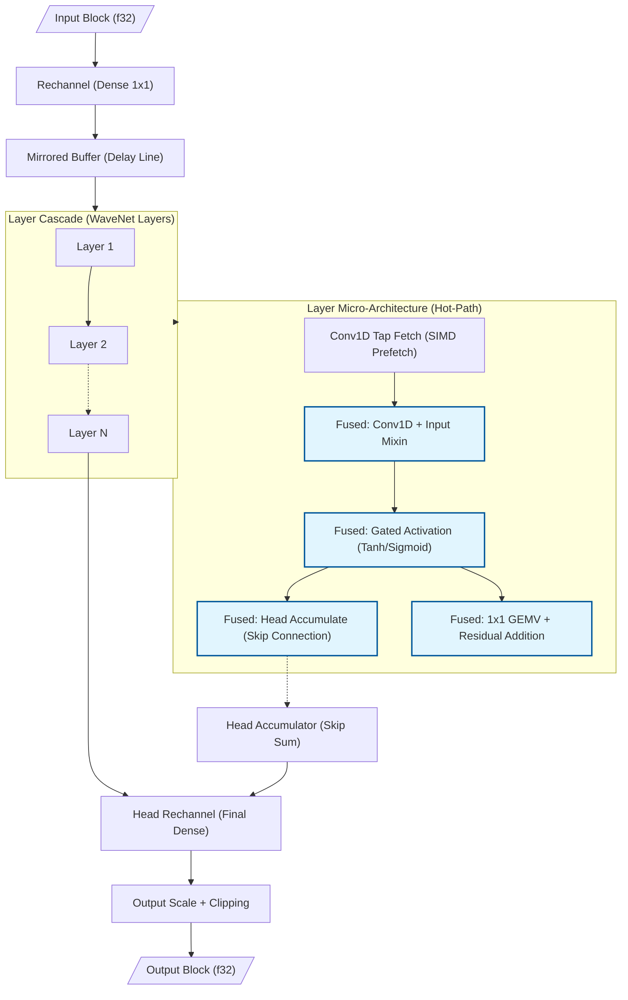
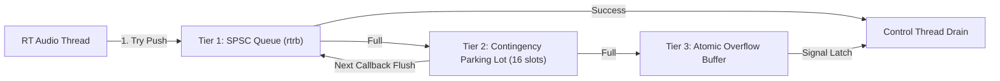
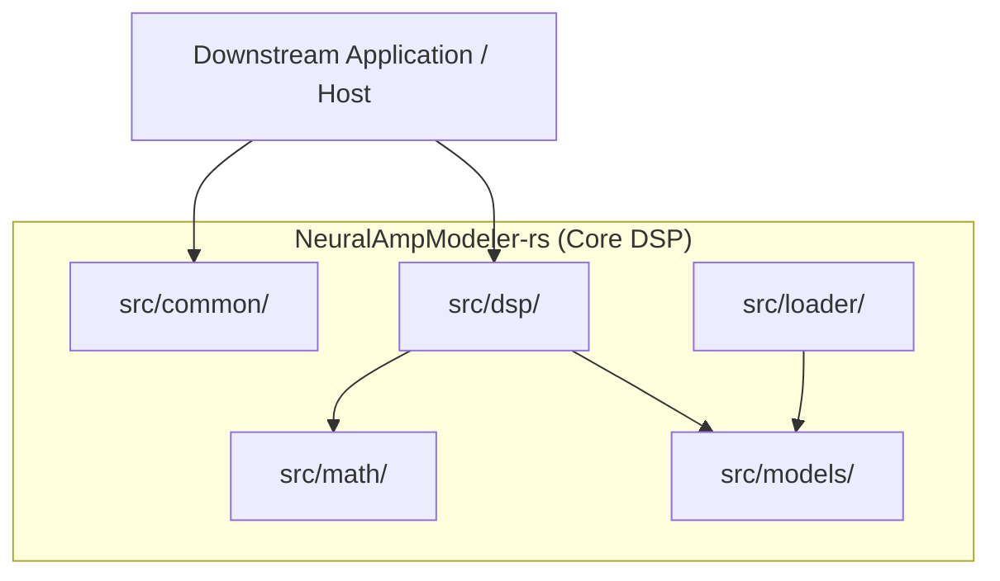

<!--
SPDX-License-Identifier: Apache-2.0
Copyright (c) 2026 Fábio Henrique de Lima Silva (fhl.bsb@gmail.com) All rights reserved.
-->

# NeuralAmpModeler-rs Architecture

This document provides the foundational architectural specification for the NeuralAmpModeler-rs DSP engine: model dispatch, SIMD microarchitecture, pipeline execution, real-time safety, memory management, and cross-cutting system design. For detailed numerical error budgets, testing methodologies, format specifications, and benchmark maps, refer to the specialized references in [docs/](.) ([`audio_fidelity_map.md`](audio_fidelity_map.md), [`testing.md`](testing.md), [`namb-spec.md`](namb-spec.md), [`cpp_parity_map.md`](cpp_parity_map.md), [`fastmath-approximations.md`](fastmath-approximations.md)).

NeuralAmpModeler-rs is a host-agnostic, low-latency DSP core engineered in idiomatic Rust for neural inference of audio equipment simulations (Neural Amp Modeler) with strict Real-Time (RT) safety guarantees. It is designed to be embedded as an `rlib` dependency in interactive audio plugins, standalone hosts, offline renderers, analysis tools, and embedded audio pipelines.

## Public-Library Boundary

The engine operates as an independent, standalone library. Downstream applications may integrate and exercise it, but they do not dictate its internal architecture. Public APIs, diagnostics, RT policies, and error codes express reusable engine concepts rather than the lifecycle, naming conventions, or transport protocols of any specific host, audio backend, or plugin format. Consumer-specific lifecycle adaptations belong downstream.

---

## 1. Inference Engine Architecture

### 1.1 Structural Dispatch: `StaticModel` Enum (Zero Vtable Routing)

To eliminate virtual table (vtable) dispatch and dynamic allocation on the real-time audio thread, NeuralAmpModeler-rs routes all neural inference through the **`StaticModel` enum** ([`src/models/mod.rs`](../src/models/mod.rs)). The enum encapsulates 23 concrete variants covering all supported architectures:

| Family                   | Variants                                                                                                            | Dispatch Strategy                        |
|:------------------------ |:------------------------------------------------------------------------------------------------------------------- |:---------------------------------------- |
| **WaveNet A1**           | `WavenetStandard` (ch=16), `WavenetLite` (ch=12), `WavenetFeather` (ch=8), `WavenetNano` (ch=4)                     | Const-generic monomorphization           |
| **WaveNet A2 Fast-Path** | `WavenetA2Full` (ch=8), `WavenetA2Lite` (ch=3)                                                                      | Const-generic monomorphization           |
| **WaveNet A2 Dynamic**   | `WavenetA2Dyn`                                                                                                      | Runtime-dimensioned GEMV / Conv1D        |
| **WaveNet A2 Cascade**   | `WavenetA2Cascade`                                                                                                  | Multi-array dynamic pipeline             |
| **WaveNet Dynamic**      | `WavenetDyn` (backed by `WaveNetModelDyn`)                                                                          | Free geometry fallback                   |
| **LSTM Static**          | `Lstm1x3`, `Lstm1x8`, `Lstm1x12`, `Lstm1x16`, `Lstm1x24`, `Lstm2x8`, `Lstm2x12`, `Lstm2x16`, `Lstm1x40`, `Lstm2x24` | Const-generic monomorphization           |
| **LSTM Dynamic**         | `LstmDyn` (backed by `LstmModelDyn`)                                                                                | Runtime dimensions fallback              |
| **Container**            | `Container` (backed by `ContainerModel`)                                                                            | Nested `StaticModel` multi-size dispatch |
| **ConvNet**              | `ConvNet` (backed by `ConvNetModel`)                                                                                | Feed-forward causal convolution chain    |
| **Linear**               | `Linear` (backed by `LinearModel`)                                                                                  | Direct SIMD FIR / Partitioned FFT        |

The audio processing entry point [`NamModel::process()`](../src/models/nam_model.rs) matches directly on `StaticModel` variants. Monomorphization and inlining allow the compiler to generate direct branches or jump tables at call sites. Within a few blocks, branch prediction stabilizes, achieving **zero dispatch overhead** in steady-state audio processing.

#### Dynamic Fallback Models

When a model's topology diverges from fixed const-generic profiles, the model loader dynamically selects one of four flexible variants:

- **`WaveNetModelDyn`** ([`src/models/wavenet/model_dyn.rs`](../src/models/wavenet/model_dyn.rs)): Handles arbitrary channel dimensions, receptive fields, condition sizes, post-stack heads, and optional `condition_dsp` sub-models.
- **`LstmModelDyn`** ([`src/models/lstm/model_dyn.rs`](../src/models/lstm/model_dyn.rs)): Supports arbitrary layer counts and hidden state sizes via runtime-dimensioned matrix-vector products.
- **`WaveNetA2Dyn`** ([`src/models/a2/model/dynamic/mod.rs`](../src/models/a2/model/dynamic/mod.rs)): Supports the full WaveNet A2 feature set (arbitrary channels, bottleneck ≠ channels, FiLM modulation, grouped convolutions, gating/blending, and head1x1).
- **`WaveNetA2Cascade`** ([`src/models/a2/model/cascade/mod.rs`](../src/models/a2/model/cascade/mod.rs)): Sequences multiple dynamic A2 arrays into an end-to-end pipeline.

Dynamic models allocate contiguous memory blocks ([`AlignedVec`](../src/math/common/aligned.rs)) during instantiation off-RT. Once loaded, their forward execution is **completely zero-allocation** and deterministic.

---

### 1.2 SIMD Architecture & Instruction Set Policy

NeuralAmpModeler-rs adheres to a deterministic, performance-first SIMD microarchitecture:

1. **Mandatory Baseline (`x86-64-v3`):**

   - The engine decrees `x86-64-v3` (AVX2, FMA, BMI1, BMI2, F16C, LZCNT, MOVBE) as its mandatory compile-time baseline (enforced via `.cargo/config.toml` and compile-time assertions in `src/lib.rs`).
   - Performance-critical DSP loops use explicit, hand-written SIMD intrinsics and const-generic layout monomorphization rather than relying on compiler auto-vectorization heuristics.

2. **SIMD Dispatch & AVX-512 Policy:**

   - Vector operations are abstracted behind the [`SimdMath`](../src/math/common/traits/mod.rs) trait and instantiated via the static `dispatch_simd!` macro.
   - **Production Backend:** `Avx2Math` is the sole production math backend. In standard release builds, CPUs lacking `x86-64-v3` support are rejected off-RT during model construction with `E5001 UNSUPPORTED_CPU_ARCHITECTURE`. No scalar fallback branches exist on the audio hot path.
   - **AVX-512 Gating & L1i Cache Defense:** AVX-512 kernels are isolated behind the opt-in `avx512` Cargo feature (`#[cfg(feature = "avx512")]`). Default builds completely omit AVX-512 code, keeping EVEX/ZMM instructions out of `.text` and defending the critical 32 KB core L1 instruction cache (L1i) budget.
   - **Architectural Rationale:** Real-time audio inference operates on small sample blocks (e.g., $N=64$). At these block sizes, AVX-512 yields negative or negligible throughput improvements over AVX2 due to CPU frequency transitions and vector setup overheads, while significantly expanding code footprint. AVX-512 sources are retained strictly for offline research, comparative benchmarking, and experimental verification. When enabled, dispatch mandates the complete `F+VL+BW+DQ` host capability matrix to prevent `SIGILL` on hypervisors.

3. **Numeric Precision (f32 vs. Reduced Precision):**

   - Inference strictly executes in single-precision `f32` (24-bit significand) to maintain bit-level fidelity and float parity with the reference C++ implementation (NAMCore).
   - Reduced precision formats (BF16, int8 VNNI) were evaluated and retired from production: compound truncation error across recurrent states and deep layer cascades introduces unacceptable SNR degradation (up to ~45 dB noise floor).

4. **AMX (Advanced Matrix Extensions) Exclusion:**

   - Intel AMX is explicitly excluded: tile configuration overhead (`ldtilecfg`/`sttilecfg`) and large minimum tile dimensions ($16 \times 64$ bytes) are fundamentally incompatible with frame-by-frame, low-latency audio processing.

5. **SIMD Outside the Audio Path:**

   - Non-DSP off-RT routines (JSON parsing, `.namb` CRC32 validation, IR file decoding) are bounded by file I/O and memory bandwidth. They remain in standard, idiomatic safe Rust.

#### Core Fused & Tiled SIMD Kernels

- **WaveNet Conv1D + Mixin + Gated Activation:** Fuses tap fetching, residual mixin, activation (`tanh`/`sigmoid`), and skip-head accumulation into continuous register operations.
- **WaveNet A2 Tap-Major Frame Tiling (CH=8):** Permutes weights into `col-major-per-tap` layout at load time, allowing contiguous 256-bit SIMD loads of 8 outputs across 4 frames ($T=4$).
- **WaveNet A2 Unrolled GEMV (CH=3):** Fully unrolls 3-channel matrix operations without loop overhead.
- **LSTM Gate-Major GEMV:** Transposes weights to `[Gate][Input][Hidden]`, computing all 4 gates (input, forget, cell, output) in a single unified pass over the state vector.
- **ConvNet Block:** Sequences causal 1D convolution, fused-affine BatchNorm1D, and nonlinear activation via ping-pong scratch buffers.
- **Linear FIR:** Direct vectorized dot product convolving input history with weights and bias.

---

### 1.3 Precision, Stability, and Denormal Protection

- **Single-Precision Consistency:** All weights, intermediate activations, and delay rings operate in `f32` to guarantee parity with NAMCore.
- **Kahan Summation:** Employed in scalar reference dot products (`src/math/common/scalar_ref/dot.rs`) to bound accumulation drift to $\mathcal{O}(\epsilon)$ instead of $\mathcal{O}(N \cdot \epsilon)$.
- **Deterministic Anti-Denormal Dither:** To prevent catastrophic CPU stalling from subnormal floats during silence, a calibrated `−220 dBFS` DC offset is injected at the input stage ([`apply_input_stage`](../src/dsp/pipeline/stages/input.rs)) and subtracted identically at the output stage ([`apply_output_stage`](../src/dsp/pipeline/stages/output.rs)). See [docs/audio_fidelity_map.md](audio_fidelity_map.md) §6.

---

### 1.4 Native Audio Model Binary Format (NAMB)

In addition to standard `.nam` JSON files, the engine supports `.namb`: a high-efficiency binary container designed for real-time audio systems:

- **v1:** Metadata JSON header + contiguous binary `f32` weights + CRC32 checksum.
- **v2:** Weights pre-transposed into kernel-optimal SIMD layouts (Gate-Major for LSTM, Interleaved-4 for WaveNet), reducing model instantiation and swap times from ~50 ms to <1 ms.

Complete specification: [docs/namb-spec.md](namb-spec.md).

---

### 1.5 WaveNet Data Flow

The following diagram illustrates data flow and fused kernel boundaries in the WaveNet inference pipeline:


```mermaid
graph TD
    In[/"Input Block (f32)"/] --> RC["Rechannel (Dense 1x1)"]
    RC --> MB["Mirrored Buffer (Delay Line)"]

    subgraph LayerCascade ["Layer Cascade (WaveNet Layers)"]
        direction TB
        L1["Layer 1"] --> L2["Layer 2"]
        L2 -.-> LN["Layer N"]
    end

    MB --> LayerCascade

    subgraph Internal ["Layer Micro-Architecture (Hot-Path)"]
        direction TB
        S1["Conv1D Tap Fetch (SIMD Prefetch)"] --> S2["Fused: Conv1D + Input Mixin"]
        S2 --> S3["Fused: Gated Activation (Tanh/Sigmoid)"]
        S3 --> S4["Fused: Head Accumulate (Skip Connection)"]
        S3 --> S5["Fused: 1x1 GEMV + Residual Addition"]
    end

    LayerCascade -.-> Internal

    LN --> HR["Head Rechannel (Final Dense)"]
    S4 -.-> HA["Head Accumulator (Skip Sum)"]
    HA --> HR
    HR --> SC["Output Scale + Clipping"]
    SC --> Out[/"Output Block (f32)"/]

    classDef fused fill:#e1f5fe,stroke:#01579b,stroke-width:2px;
    class S2,S3,S4,S5 fused;
```

#### Multi-Array Head Cascade Rule

For multi-array WaveNet architectures, the head accumulator of the second layer array (`array2`) is seeded directly with the projected skip-connection output of `array1` rather than starting from zero. This preserves exact parity with the reference C++ implementation (`out = head_scale * array2.head_outputs`). See [`src/models/wavenet/model.rs`](../src/models/wavenet/model.rs) and [docs/cpp_parity_map.md](cpp_parity_map.md) §4.6.

---

### 1.6 Virtual Memory Mirroring: `MirroredBuffer`

To eliminate circular index wrapping and modulo branching in dilated convolution delay lines, the engine implements virtual memory mirroring ([`src/dsp/mirror_buf/alloc.rs`](../src/dsp/mirror_buf/alloc.rs)):

- **Mechanism:** Allocates a physical memory region via `memfd_create` and maps it twice consecutively into contiguous virtual memory using `mmap(MAP_SHARED)`. This allows read lookbacks across the buffer boundary to be executed via simple pointer arithmetic without branch penalties.
- **Linux Allocation Hierarchy:**
  1. 2 MB HugeTLB pages (`MAP_HUGETLB` / `MFD_HUGETLB`) to minimize TLB misses.
  2. Transparent Huge Pages (THP via `MADV_HUGEPAGE` / `MADV_COLLAPSE`).
  3. Standard 4 KB pages.
- **Descriptor Lifecycle:** `libc::close(fd)` is called immediately after mappings succeed. On Linux, `MAP_SHARED` maintains page residency independently of the file descriptor; mappings are freed cleanly during `Drop` via `munmap`.
- **Portability:** Non-Linux platforms compile a fallback stub returning `Unsupported`.

---

## 2. Real-Time Safety & Concurrency Architecture

### Real-Time Invariants (Audio Thread Hot Path)

The audio thread operates under strict real-time guarantees:

- **Zero Allocations & Zero Deallocations:** No heap allocation (`Vec`, `Box`, `String`) or object drops inside `process()`.
- **Zero Blocking I/O & Locks:** Mutexes, condition variables, file access, and logging (`log::*`) are prohibited on the hot path. State anomalies are communicated via atomic bitmasks ([`RtStatusFlags`](../src/common/spsc/status.rs)).
- **Panic-Free Operation:** Bounds checks are statically structured or asserted off-RT.
- **Low-Overhead Telemetry:** Direct read of the CPU Time Stamp Counter (RDTSC) replaces `Instant::now()` (vDSO syscall) for sub-nanosecond, single-cycle profiling without kernel jitter.
- **Cache-Line Isolation:** SPSC communication structures are aligned to 128 bytes (`#[repr(align(128))]`) to prevent multi-core false sharing between audio and control threads.

### Host Hardening (Linux RT)

When real-time host hardening is enabled (via the `rt-hardening` feature or external configuration):

- **Scheduling:** `SCHED_FIFO` with IRQ-aware core affinity (`select_optimal_cpu`).
- **Memory Locking:** `mlockall(MCL_CURRENT | MCL_FUTURE)` to eliminate page faults.
- **Power Management:** PM-QoS lock (`/dev/cpu_dma_latency`) prevents CPU deep C-state sleep transitions.
- **Kernel Spikes:** THP compaction spikes are disabled via `prctl(PR_SET_THP_DISABLE)`.

---

### 2.1 Garbage Collection Cascade (GC Pipeline)

Deallocating retired models, impulse responses, or resamplers (~MBs) directly on the audio thread introduces catastrophic latency spikes. The Garbage Collection pipeline ([`src/common/spsc/gc.rs`](../src/common/spsc/gc.rs)) routes retired resources off the audio thread through a 3-tier cascade:


```mermaid
graph LR
    RT[RT Audio Thread] -->|1. Try Push| T1["Tier 1: SPSC Queue (rtrb)"]
    T1 -->|Success| OFF[Control Thread Drain]
    T1 -->|Full| T2["Tier 2: Contingency Parking Lot (16 slots)"]
    T2 -->|Next Callback Flush| T1
    T2 -->|Full| T3["Tier 3: Atomic Overflow Buffer"]
    T3 -->|Signal Latch| OFF
```

1. **Tier 1 — SPSC Channel:** Fast-path lock-free ring (`rtrb`).
2. **Tier 2 — Parking Lot:** Fixed 16-slot array (`[Option<GcItem>; 16]`) owned by the RT producer. Automatically flushed to Tier 1 whenever capacity frees up.
3. **Tier 3 — Overflow Buffer:** Overwrite ring of packed atomic words setting `RT_STATUS_GC_TIER3` (and `RT_STATUS_GC_OVERFLOW` on overwrite).

The control thread drains all three tiers periodically and during shutdown via [`drain_gc_channels()`](../src/common/spsc/gc.rs), dropping retired memory safely outside the audio hot path.

---

### 2.2 Structural Swap Scheduler (`common::spsc::swap`)

Dynamic changes to off-RT resources (model switching, IR loading, resampler reconfiguration) are governed by the generic structural swap protocol ([`src/common/spsc/swap.rs`](../src/common/spsc/swap.rs)):

- **Phase 0 — Deferred Resolution:** Resolves commands parked by the previous callback. Stale or superseded requests are discarded directly into the GC sink.
- **Phase 1 — Bounded Drain & Coalescing:** Drains new commands up to `SwapTunables::pops_per_callback`. Commands sharing the same coalesce key collapse to the latest one (latest-wins); scalar parameters apply inline.
- **Phase 2 — Budgeted Apply or Park:** Applies up to `SwapTunables::swaps_per_callback` structural swaps. Excess swaps park in a single deferred slot for Phase 0 resolution in the next callback.
- **Core Components:**
  - `RtSwapDrain`: Per-channel swap receiver and deferred slot manager.
  - `SwapBudget`: Shared per-callback swap allowance.
  - `GcSink`: Encapsulates the 3-tier GC cascade dependencies.
  - `RtSwapHandler`: Trait defining payload classification, coalescing keys, and `#[cold]` installation/discard hooks.

---

## 3. Module Structure & Feature Flags

### Layered Architecture

NeuralAmpModeler-rs separates the host-agnostic DSP core into distinct architectural layers:

| Layer            | Path                | Responsibility                                                                                     |
|:---------------- |:------------------- |:-------------------------------------------------------------------------------------------------- |
| **Common**       | `src/common/`       | Diagnostics, error codes, lock-free SPSC primitives, panic hooks, and parameter models.            |
| **Math**         | `src/math/`         | SIMD kernels (AVX2/AVX-512), `SimdMath` dispatch, activations, matrix math, and aligned vectors.   |
| **Models**       | `src/models/`       | Neural network architectures: WaveNet (A1/A2), LSTM, ConvNet, Linear, and Containers.              |
| **DSP Core**     | `src/dsp/`          | Pipeline stages, native resampler, noise gate, oversampling, cabsim convolution, adaptive compute. |
| **Loader**       | `src/loader/`       | `.nam` (JSON) and `.namb` (binary) parsers, topology detection, weight unpackers, and builders.    |
| **RT Hardening** | `src/rt_hardening/` | Optional Linux real-time system tuning (`mlockall`, `SCHED_FIFO`, affinity, PM-QoS).               |
| **Testing**      | `src/testing/`      | Off-RT perceptual metrics, spectral analysis, and reference oracles (gated behind `testing`).      |


```mermaid
graph TD
    subgraph Engine ["NeuralAmpModeler-rs (Core DSP)"]
        Common["src/common/"]
        Math["src/math/"]
        Models["src/models/"]
        Loader["src/loader/"]
        DSP["src/dsp/"]
    end

    Host["Downstream Application / Host"] --> Common
    Host --> DSP
    DSP --> Models
    DSP --> Math
    Loader --> Models
```

### Feature Flags

| Feature                  | Default | Description                                                                                                                                                                            |
|:------------------------ |:------- |:-------------------------------------------------------------------------------------------------------------------------------------------------------------------------------------- |
| **`dual-mono`**          | **Yes** | Dual-model processing: runs independent model instances for left and right channels without crosstalk. Disabling (`--no-default-features`) switches to lean single-channel processing. |
| **`testing`**            | No      | Exposes off-RT test utilities, signal generators, perceptual metrics, and reference oracles.                                                                                           |
| **`heap-audit`**         | No      | Activates allocation-tracking hooks for automated zero-allocation hot-path validation.                                                                                                 |
| **`fft-radix4-planner`** | No      | Exposes Radix-4 DIT FFT execution planning benchmark routines.                                                                                                                         |
| **`avx512`**             | No      | Compiles research/benchmarking AVX-512 upward dispatch kernels (omitted from default binaries).                                                                                        |
| **`rt-hardening`**       | No      | Enables Linux real-time process hardening (`mlockall`, `SCHED_FIFO`, core pinning, PM-QoS).                                                                                            |

---

## 4. DSP Signal Chain & Processing Pipeline

### Audio Processing Flow

```text
Host Input Audio (Sample Rate: Nk Hz)
    │
    ▼ Gate FSM: Noise Gate Hysteresis + SIMD Linear Ramp
    ▼ Input Gain Stage (SIMD) + Anti-Denormal Dither Injection
    │
    ▼ Input Resampler: NamResampler (Nk Hz → 48 kHz)
    │
    ▼ Neural Inference: NamModel::process (48 kHz)
    │   [Optional 2×/4× Half-Band Oversampling]
    │   [Adaptive Compute Complexity Scaling]
    │
    ▼ Output Resampler: NamResampler (48 kHz → Nk Hz)
    │
    ▼ Output Gain Stage (SIMD) + Dither Subtraction + Soft-Clip Protection
    │
    ▼ CabSim IR Convolution (UPOLS Frequency-Domain FIR, Optional Bypass)
    │
Host Output Audio (Sample Rate: Nk Hz)
```

### 4.1 Native Polyphase Sinc Resampler (`NamResampler`)

Neural networks are trained at a fixed 48 kHz sample rate. When the host runs at a different rate, the engine converts sample rates using a native polyphase sinc resampler ([`src/dsp/resampler/mod.rs`](../src/dsp/resampler/mod.rs)):

- **Filter Topology:** 256 phases × 64 taps Kaiser-windowed sinc ($\beta=12$).
- **Minimum-Phase Transformation:** Employs real cepstrum f64 FFT transformation to concentrate filter energy into the shortest possible delay, completely eliminating pre-ringing in real-time monitoring.
- **Linear-Phase Mode:** `NamResampler::new_linear()` is provided for offline rendering workflows where linear phase is required.
- **Native Rate Bypass:** When host sample rate equals 48 kHz, samples pass through with zero convolution overhead.

### 4.2 Noise Gate FSM

The noise gate ([`src/dsp/gate.rs`](../src/dsp/gate.rs)) employs a Schmitt trigger with independent opening and closing thresholds to prevent chattering at noise floor boundaries. Transitions apply vectorized linear ramping for smooth, artifact-free gain changes.

### 4.3 Oversampling Engine (Anti-Aliasing)

Optional 2× or 4× oversampling ([`src/dsp/oversample.rs`](../src/dsp/oversample.rs)) suppresses aliasing from nonlinear neural activations:

- **Filter Design:** Half-band FIR filters (25 taps, Kaiser $\beta=12$, >100 dB stopband attenuation). The half-band property $h[2n] = 0$ ($n \neq D/2$) cuts MAC operations per sample in half.
- **RT Safety:** Filter buffers and delay lines are allocated during construction off-RT. Switching oversampling factors initiates an off-RT rebuild transferred via SPSC.
- **LSTM Recurrent Characteristic:** In recurrent architectures (LSTM), oversampling increases the discrete clock rate ($\Delta t = 1/f_s$), modulating the physical decay time window of recurrent states. Running oversampling with LSTMs is an intentional acoustic choice rather than a transparent anti-aliasing filter (see [docs/audio_fidelity_map.md](audio_fidelity_map.md) §3.2).

### 4.4 Adaptive Compute (CPU Overload Protection)

To prevent audio dropouts (xruns) under severe CPU load, the Adaptive Compute FSM ([`src/dsp/adaptive.rs`](../src/dsp/adaptive.rs)) dynamically scales neural network complexity:

- **Hysteresis States:** `Full` $\leftrightarrow$ `Reduced` $\leftrightarrow$ `Minimal`. State changes require consecutive blocks exceeding execution budget thresholds (e.g. 70% and 85%).
- **Smooth Transition:** A 32 ms linear parameter crossfade blends outputs during structural adjustments.
- **Offline Rendering Bypass:** When offline rendering is active, Adaptive Compute is forced to `Off`, disabling all degradation and guaranteeing deterministic, maximum-quality output regardless of CPU load.
- **Slimmable Integration:** Drives runtime `A2-Full` $\to$ `A2-Lite` model degradation for slimmable containers.

### 4.5 IR CabSim: UPOLS Convolution Engine

The cabsim stage convolves model output with speaker cabinet impulse responses ([`src/dsp/cabsim/conv.rs`](../src/dsp/cabsim/conv.rs)):

- **Algorithm:** Uniform-Partitioned Overlap-Save (UPOLS) in the frequency domain. Partition size matches the audio block size.
- **Frequency Delay Line (FDL):** Pre-allocated circular buffer of input spectra, convolving all partitions in the frequency domain before an inverse FFT.
- **Release-Safe Block Contract:** `ConvEngine::process()` verifies in both debug and release builds that input and output slices meet or exceed `partition_size`. If a sub-partition block is received, the engine safely clears the output buffer and signals `RT_STATUS_CABSIM_CONTRACT_VIOLATION` without panicking. Variable-block hosts buffer samples through `CabSimAdapter`.

---

## 5. WaveNet A2 Architecture

The WaveNet A2 format represents the next-generation architecture of Neural Amp Modeler (NeuralAmpModelerCore v0.5.2+):

### Fast-Path Engines

When an A2 model conforms to standard 23-layer fixed shapes, the loader routes execution to specialized fast-path kernels matching `NAM/wavenet/a2_fast.cpp`:

- **A2-Full (`WaveNetA2<8>`):** 8 channels, tap-major frame-tiled convolution ($T=4$ broadcast FMA), bit-exact with C++ reference.
- **A2-Lite (`WaveNetA2<3>`):** 3 channels, fully unrolled matrix-vector kernel.

### Dynamic & Cascade Engines

For models containing advanced features, execution routes to flexible runtime engines:

- **`WaveNetA2Dyn`:** Runtime-dimensioned convolution supporting arbitrary channel dimensions, bottleneck layers, FiLM modulation, grouped convolutions, and gating/blending activations.
- **`WaveNetA2Cascade`:** Chains multiple dynamic A2 arrays in series.
- **Slimmable Containers:** Pre-allocates both A2-Full and A2-Lite submodels in memory, enabling instantaneous zero-allocation swaps via the Adaptive Compute FSM with 32 ms crossfading.

*(Note: The flagship model `wavenet_a2_max.nam` triggers a permanent known bug in upstream C++ parity and is rejected at load time via fail-closed guard `reject_wavenet_a2_max_class`. See [docs/cpp_parity_map.md](cpp_parity_map.md) §4.3).*

---

## 6. Error Catalog & Diagnostics (`NamErrorCode`)

Typed error codes are defined in [`src/common/diagnostics/error_codes.rs`](../src/common/diagnostics/error_codes.rs).

| Range       | Domain                  | Status & Responsibility                                                                                                                                                                                                |
|:----------- |:----------------------- |:---------------------------------------------------------------------------------------------------------------------------------------------------------------------------------------------------------------------- |
| **`E1xxx`** | Model Loading & Parsing | **Core Crate.** I/O errors, JSON/NAMB parsing, CRC32 checks, shape validation, and OOM limits.                                                                                                                         |
| **`E2xxx`** | Audio / DSP / Real-Time | **Reserved for Downstream Hosts**, with two pure DSP exceptions constructed by the core: `E2200` (`ResamplerBuildFailed` for invalid sample rates) and `E2202` (`InvalidCabsimPartitionSize` for zero partition size). |
| **`E3xxx`** | SPSC Communication      | **Reserved for Downstream Hosts.** Param queue overflow, GC ring status.                                                                                                                                               |
| **`E4xxx`** | Runtime / Host Control  | **Reserved for Downstream Hosts.** Gain parsing, CLI commands, IR file loading.                                                                                                                                        |
| **`E5xxx`** | System & Hardware       | **Core Crate.** `E5000` (Out of Memory), `E5001` (Unsupported CPU Architecture lacking `x86-64-v3`).                                                                                                                   |

### Complete Error Code Reference

- **E1xxx (Model Loading):** `E1100` FILE_NOT_FOUND, `E1101` FILE_READ_ERROR, `E1102` UNKNOWN_EXTENSION, `E1200` NAM_JSON_PARSE_ERROR, `E1201` NAMB_CRC32_MISMATCH, `E1202` NAMB_INVALID_MAGIC, `E1203` NAMB_UNSUPPORTED_VERSION, `E1204` NAMB_TRUNCATED, `E1205` NAMB_CRC32_MISSING, `E1206` NAM_JSON_WEIGHTS_EXCEED_LIMIT, `E1207` NAM_JSON_TRAINING_TOO_LARGE, `E1208` NAM_JSON_TRAINING_TOO_DEEP, `E1209` NAM_JSON_SUBMODELS_EXCEED_LIMIT, `E1210` NAM_JSON_SUBMODELS_TOO_DEEP, `E1211` NAM_JSON_WEIGHT_NOT_FINITE, `E1212` NAMB_NON_FINITE_WEIGHT, `E1213` NAMB_INVALID_HEADER_FIELD, `E1214` NAM_JSON_INVALID_SAMPLE_RATE, `E1215` NAM_JSON_UNSUPPORTED_TOPOLOGY, `E1216` NAM_JSON_INVALID_VERSION_FORMAT, `E1217` NAM_JSON_UNSUPPORTED_VERSION, `E1218` NAM_JSON_UNSUPPORTED_MULTI_CHANNEL, `E1219` INVALID_METADATA, `E1300` UNSUPPORTED_ARCHITECTURE, `E1301` TOPOLOGY_DETECTION_FAILED, `E1302` WEIGHT_COUNT_MISMATCH, `E1303` MODEL_BUILD_FAILED, `E1304` MODEL_TOO_LARGE, `E1305` INVALID_MODEL_TOPOLOGY.
- **E2xxx (Audio / DSP):** `E2001` PROCESSING_OVERLOAD, `E2100` AUDIO_INIT_FAILED, `E2101` STREAM_ERROR, `E2200` RESAMPLER_BUILD_FAILED, `E2201` RESAMPLER_CHANNEL_FULL, `E2202` INVALID_CABSIM_PARTITION_SIZE, `E2300` RT_PRIORITY_DENIED, `E2301` CPU_AFFINITY_FAILED, `E2302` BACKEND_FAILURE, `E2304` HOST_FORMAT_CONTRACT_VIOLATION.
- **E3xxx (SPSC):** `E3100` PARAM_CHANNEL_FULL, `E3101` GC_OVERFLOW, `E3102` GC_CORRUPTED.
- **E4xxx (Runtime):** `E4100` INVALID_GAIN_VALUE, `E4101` UNKNOWN_COMMAND, `E4102` CTRL_C_HANDLER_FAILED, `E4103` IR_LOAD_FAILED.
- **E5xxx (System):** `E5000` OUT_OF_MEMORY, `E5001` UNSUPPORTED_CPU_ARCHITECTURE.

### Crash Diagnostics & Cache Retention

In the event of an unhandled panic, the engine's panic hook ([`src/common/panic_hook.rs`](../src/common/panic_hook.rs)) generates a zero-allocation diagnostic dump using a stack-allocated buffer (`[u8; 16384]`) and writes it to `~/.cache/neural-amp-modeler-rs/crash-<timestamp>-<component>.txt`.

- **FIFO Retention (`MAX_CRASH_FILES = 10`):** The hook prunes the oldest files when total crash logs exceed 10.
- **Programmatic Pruning:** Hosts can invoke `DiagnosticBundle::purge_old_reports(max_age_secs)` during startup to remove stale crash files.

---

## 7. Testing, Verification, and References

- **Testing Architecture:** Multi-tier testing methodology, the three-oracle model (NAMCore f32 parity, f64 ideal oracle, cross-ISA parity), and CI verification scripts are specified in [docs/testing.md](testing.md) and [docs/perceptual_validation.md](perceptual_validation.md).
- **Audio Fidelity:** Detailed numerical analysis of fast math approximations, oversampling stopbands, and denormal protection: [docs/audio_fidelity_map.md](audio_fidelity_map.md).
- **Reference Implementations:**
  - [NeuralAmpModelerCore](https://github.com/sdatkinson/NeuralAmpModelerCore): Reference C++ implementation of NAM.
  - [NeuralAudio](https://github.com/mikeoliphant/NeuralAudio): Historical reference for initial vector verification.
