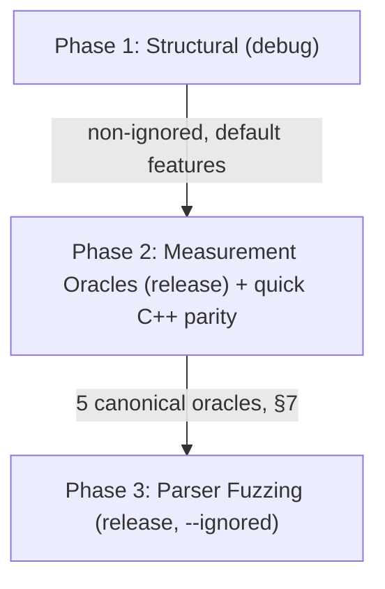

<!--
SPDX-License-Identifier: Apache-2.0
Copyright (c) 2026 Fábio Henrique de Lima Silva (fhl.bsb@gmail.com) All rights reserved.
-->

# Test Architecture

This document explains *how* the suite is organized and *why* tests sit in a given phase. The live inventory is the source tree (`tests/`, `src/**/*_test.rs`) plus typed receipts (`tests/models/receipt_test.rs`, `src/bin/capability_receipt.rs`). Do not maintain a parallel module-by-module table here — it drifts.

> [!NOTE]
> **Document scope.** This document covers the *functional/correctness* `cargo test` architecture: [utils/tests-quick.sh](../utils/tests-quick.sh) (agile first line) and [utils/tests-long.sh](../utils/tests-long.sh) (nightly/pre-release audit). Static analysis ([utils/lints.sh](../utils/lints.sh)) and performance benchmarking are out of scope here:
>
> - [utils/tests-performance-regression.sh](../utils/tests-performance-regression.sh) is the canonical, baseline-gated performance-regression wall. Its full rationale, workflow, and troubleshooting live in [benchmarks.md](benchmarks.md) ("Regression Gate" section).
> - Benchmarks are executed via `cargo bench` or `utils/tests-performance-regression.sh` and are excluded from the nightly test runner ([utils/tests-long.sh](../utils/tests-long.sh)).

---

## 1. Crate Features Taxonomy

The `NeuralAmpModeler-rs` crate defines several features in [Cargo.toml](../Cargo.toml) to customize build targets and test capabilities:

| Feature Name         | Description                   | Active Dependencies / Modules          | Gated Scope                                                                                                              |
|:-------------------- |:----------------------------- |:-------------------------------------- |:------------------------------------------------------------------------------------------------------------------------ |
| **`testing`**        | Test utilities & generators   | Gated test modules & binary tools      | [src/testing/](../src/testing/), `gen_stress`, `wav_to_golden`                                                           |
| **`stereo`**         | Enable stereo DSP processing  | DSP input/output buffers               | [src/dsp/pipeline/stages/input.rs](../src/dsp/pipeline/stages/input.rs) (Stereo variants)                                |
| **`heap-audit`**     | Memory watchdog tracking      | Global `CountingAllocator` interceptor | [src/common/alloc_audit.rs](../src/common/alloc_audit.rs), [tests/rt_constraints/](../tests/rt_constraints/) heap checks |
| **`long_bench`**     | Extended criterion benchmarks | `long_inference_bench`                 | [benches/long_inference_bench.rs](../benches/long_inference_bench.rs) (benchmark cycles >30s)                            |
| **`dynamic-engine`** | A2 dynamic engine runtime     | A2 dynamic compute submodules          | [src/dsp/](../src/dsp/)                                                                                                  |

---

## 2. Test Execution Phase Architecture — Two-Axis Model

Test placement is governed by **two orthogonal axes**, not by a single "fast vs. slow" heuristic:

- **Axis A — Rigor (encoded via `#[ignore]`):** non-ignored = first line of defense (runs every sprint, several times a day); `#[ignore]` = long/rigorous (runs ~1×/day via `--ignored`). This is the *rigor* axis.
- **Axis B — Codegen Path (encoded via debug vs. `--release`):** structural tests (logic, parsers, FSM, bitwise determinism) run in **debug** (cheap, with `debug-assertions` ON, where float codegen is irrelevant); measurement oracles (anything comparing floats against a reference) run in **`--release`** (the codegen path users actually execute). Measuring in debug guards a "phantom" — codegen without `-O3`, without FMA contraction, without auto-vectorization.

The quick suite ([utils/tests-quick.sh](../utils/tests-quick.sh)) has three phases that respect both axes:



### Phase 1 — Structural (debug, default features)

- **Goal:** logic, parsers, FSM transitions, loaders, SPSC, bitwise determinism.
- **Scope:** `cargo test --lib` (unit, auto-discovered) + integration entry points ([tests/models.rs](../tests/models.rs), [tests/perf_soak.rs](../tests/perf_soak.rs), [tests/parity.rs](../tests/parity.rs), [tests/dsp_core.rs](../tests/dsp_core.rs), [tests/target_features_compliance_test.rs](../tests/target_features_compliance_test.rs), [tests/libm_export_guard.rs](../tests/libm_export_guard.rs)). `rt_constraints` is compiled only in the long suite (heap-audit / RT timing).
- **Excluded by design** (via `--skip <module>::` module-prefix filters — exact module matches):
  - The measurement-oracle modules (→ Phase 2, release): `golden_vectors`, `cpp_parity`, `reference_oracle_f64`, `isa_parity`, `spectral_fidelity`, `linear_fft_test`. Running them in debug would both duplicate Phase 2 and measure a codegen "phantom" (Axis B, §7).
  - `rt_deadline` / `rt_jitter` (timing characterization → deferred to the long suite, Phases 4 and 5, release-only; asserting deadlines in debug is meaningless).
  - `proptest_parsers` (parser fuzzing → Phase 3, release `--ignored`).
- **Parallel execution safety:** Integration tests run in parallel by default (`--test-threads > 1`). Process-wide mutable state (such as activation mode precision in `src/math/activations/mod.rs`) is guarded by atomic state wrappers (`AtomicUsize`) and thread guards (`PrecisionGuard`, `REPORT_LOCK`).

### Phase 2 — Measurement Oracles (release, gate of production floats)

- **Goal:** the 5 canonical oracles of §7 measure the float path that ships.
- **Scope (combined into a single `cargo test` invocation per dependency branch to avoid recompiling multiple times):**
  - Always: `reference_oracle_f64` + `spectral_fidelity` + `linear_fft_test` (committed dependencies; mathematical oracle tests always run, C++ golden tests skip gracefully when goldens absent).
  - With committed goldens: `golden_vectors` (v1) + `isa_parity` (v2, requires `--test-threads=1` per §7; the others tolerate parallel execution).
  - With `NeuralAmpModelerCore`: `cpp_parity quick_parity` (separate invocation — the `quick_parity` filter would suppress other oracles if combined). Covers LSTM 1×16 (Fast + HF), WaveNet CH16 (Fast + HF), A2-Full, and ConvNet (note: ConvNet skips at runtime as C++ NAMCore render expects standard layout).
- **Prerequisites:** missing goldens or NAMCore print `WARN` and `FIDELITY: INCOMPLETE` (exit 0). `NAM_QUICK_STRICT=1` promotes those gaps to FAIL. Never report `FIDELITY: OK` when an oracle was skipped.

### Phase 3 — Parser Fuzzing (release, `--ignored`, capped)

- **Goal:** Tier 1 parser robustness and security verification.
- **Scope:** `proptest_parsers` with `PROPTEST_CASES=1000` (configurable via `NAM_QUICK_PROPTEST_CASES`). The long suite runs the full case counts (up to 100,000 cases).

### Heap Audits — delegated to the long suite

- Heap-audit integration tests run in [utils/tests-long.sh](../utils/tests-long.sh) Phase 3 in **release**. They are out of the quick loop.

### Golden Vector Supply Chain

Phase 2's `golden_vectors` (v1) and `isa_parity` (v2), and the long suite's `cpp_parity` full matrix and `golden_vectors` v2 multi-SR, compare against pre-committed `.bin` golden files rendered off-line by [tests/fixtures/golden_gen_build.sh](../tests/fixtures/golden_gen_build.sh) against pinned reference versions defined in [variables.env](../variables.env).

- **Golden Freshness Manifest:** [tests/fixtures/golden_gen_build.sh](../tests/fixtures/golden_gen_build.sh) commits a versioned `.golden_manifest.sha256` freshness manifest checked automatically by [utils/tests-quick.sh](../utils/tests-quick.sh) Phase 2. A `sha256sum`-based gate hard-fails if a `.nam` model is modified without regenerating the corresponding golden vector.

- **Model Resolution Order:** `golden_gen_build.sh` resolves `.nam` models through `resolve_nam_model()`, matching `src/testing/fixtures.rs::model_path`: (1) `$NAM_MODELS_DIR`, (2) `third-party/community_models/` (via `NAM_THIRD_PARTY_DIR`), (3) `tests/fixtures/models-nondist`, (4) `tests/fixtures/models`. See [fixtures.md](fixtures.md) for skip semantics and non-distributable golden handling.

- **Libm Export Guard:** [tests/libm_export_guard.rs](../tests/libm_export_guard.rs) is the canonical, fail-closed ELF surface gate over the *linked* binary, run automatically in `tests-quick.sh` Phase 1 and `tests-long.sh` Defense phase (see [postmortem-libm-symbol-interposition.md](postmortem-libm-symbol-interposition.md)). The former standalone wrapper `utils/debug/verify_no_libm_exports.sh` was removed: it scanned `.rlib` archives — the wrong surface, since object archives still carry `T` exports before the version script applies — and silently skipped when the artifact was missing.

---

## 3. Placement Rules (source of truth = code)

Entry points: [tests/models.rs](../tests/models.rs), [tests/parity.rs](../tests/parity.rs), [tests/perf_soak.rs](../tests/perf_soak.rs), [tests/rt_constraints.rs](../tests/rt_constraints.rs), [tests/dsp_core.rs](../tests/dsp_core.rs), plus standalones `target_features_compliance_test`, `libm_export_guard`, `loom_tests`.

| Axis                                                          | Rule                                        | Runner                                                                                                         |
|:------------------------------------------------------------- |:------------------------------------------- |:-------------------------------------------------------------------------------------------------------------- |
| Structural / logic / loaders / FSM / bitwise                  | non-ignored, **debug**                      | `tests-quick.sh` Phase 1 (`--lib` + all entry points; skip oracle modules)                                     |
| Production-float oracles                                      | non-ignored, **`--release`**                | `tests-quick.sh` Phase 2 (`golden_vectors` v1, `cpp_parity quick_parity`, f64, spectral, linear FFT, ISA AVX2) |
| Capped parser fuzz                                            | `#[ignore]`, release, `PROPTEST_CASES=1000` | `tests-quick.sh` Phase 3                                                                                       |
| Full matrix / soak / heap-audit / RT / loom / defense scripts | `#[ignore]` or feature-gated                | `tests-long.sh`                                                                                                |

A module not listed in a runner is an orphan. `#[ignore]` without a long-suite hook is an orphan. Gaps must print `WARN`/`FIDELITY: INCOMPLETE`, never `FIDELITY: OK`.

---

## 3b. Module index (do not treat as inventory)

The previous per-module table lived here and drifted. Discover modules with:

```sh
ls tests/{models,parity,perf_soak,rt_constraints,dsp_core}/*.rs
rg -n '#\[test\]|#\[ignore\]' tests src --glob '*test*.rs'
```

## 4. Summary of Decoupled Audits (Long QA Suite)

Certain tests are marked as `#[ignore]` in the standard suite to keep execution times fast (~2 minutes). The core C++ parity, parser fuzzing, and SIMD precision gates run in Phase 2/3 of the quick QA suite. The remaining ignored tests are deferred to the nightly/pre-release auditing script ([utils/tests-long.sh](../utils/tests-long.sh)).

Before any timed phase, two **blocking pre-flight gates** run:
[tests/models/meta_coherence.rs](../tests/models/meta_coherence.rs) (catalog↔test
coherence against the Rust golden registry
[src/testing/catalog.rs](../src/testing/catalog.rs) — the single source of
truth; the generator consumes it via `nam_golden_catalog
emit-catalog`, so no bash catalog array exists) and `catalog_preflight`
(`cargo test --features testing --release --test models catalog_preflight`),
which validates every fixture, every v1 golden binary (DistributedCore model
goldens + LocalNonDistributable WaveNet Lite + CabSim convolution goldens)
through `validate_v1_goldens()`, and every expected V2 golden binary on disk
through `validate_v2_catalog()`. The former bash golden lists
(`REQUIRED_GOLDEN_MODELS` / `NONDIST_GOLDEN_MODELS` / `REQUIRED_CABSIM_GOLDENS`)
and the Phase-0 auto-rebuild in `tests-long.sh` were removed:
regenerate missing goldens with `tests/fixtures/golden_gen_build.sh`.

The battery itself runs in sequential phases (see `utils/tests-long.sh`):

1. **Soak / concurrency** (`#[ignore]`): 10M+ frame endurance plus heavy `concurrency_stress` ([tests/perf_soak/](../tests/perf_soak/)).
2. **Defense**: Rust harness `tests/qa_defense.rs` (F-01/F-08/F-21/F-22/F-24/F-27/S3-T01), Rust `libm_export_guard`, bounded oversample unit tests.
3. **Full proptest / parity / golden v2 / ISA / spectral baselines**.
4. **Heap-audit** (`heap-audit` feature).
5. **RT deadline** (release, non-ignored).
6. **RT jitter** (`#[ignore]`, telemetry; may be `INCONCLUSIVE`).
7. **Loom** (`--cfg loom`).

**Structured audit receipt:** as each phase completes, its
outcome is appended as one JSONL line to `target/logs/long-audit-receipt.jsonl`
by the Rust emitter `nam_long_receipt append` (built from
[src/bin/nam_long_receipt.rs](../src/bin/nam_long_receipt.rs); all JSON is
generated by serde in [src/testing/receipt.rs](../src/testing/receipt.rs) —
the shell never hand-serializes). Line schema:

```json
{"phase_id":"phase1","name":"Soak Tests (Numerical Stability)","status":"PASSED",
 "duration_ms":42000,"tests_executed":26,"gaps":[],"timestamp":"2026-08-14T03:00:00Z"}
```

- `phase_id`: `phase1`..`phase7` (emission order), then `overall` for the suite line.
- `status`: `PASSED` | `FAILED` | `SKIPPED` | `INCONCLUSIVE` | `SKIP_CAPABILITY` | `NOT_RUN`; the suite line uses `PASSED` | `FAILED` | `COMPLETED_WITH_GAPS`.
- `tests_executed`: count parsed from the phase log's `test result:` lines (`passed`+`failed`+`measured`; criterion `time:` lines as fallback).
- `gaps`: canonical typed markers detected in the phase log (`inconclusive_environment`, `skip_capability`, `inconclusive`, `missing_required`) plus the phase's own gap status; the suite line lists gap phases as `phase_id:STATUS`.
- `timestamp`: ISO-8601 UTC emission time.

**Preflight trace:** every preflight step that runs
ahead of Phase 1 also appends its own line (`preflight-render`,
`preflight-catalog`, `preflight-package`, `preflight-freshness`,
`preflight-meta`) with the same schema. When a preflight aborts, the suite
emits its `FAILED` line (plus any auto-detected log markers, e.g.
`missing_required` for a missing RequiredLocal golden), derives and appends the
`overall FAILED` verdict, and only then exits 1 — a failure before the first
timed phase still leaves a machine-readable trace. The canonical preflight ids
live in [src/testing/receipt.rs](../src/testing/receipt.rs)
(`PREFLIGHT_PHASE_IDS`); `nam_long_receipt append` and `validate` reject any
`preflight-*` id outside that set fail-closed.

Before the final verdict, `nam_long_receipt summary` derives and appends the
`overall` line (any `FAILED` phase or preflight ⇒ `FAILED`; else any gap status ⇒
`COMPLETED_WITH_GAPS`; else `PASSED`). `nam_long_receipt validate` verifies
the whole file fail-closed. A receipt-emission failure makes the suite exit 1
(fail-closed; the receipt is part of the nightly deliverable).

`#[ignore]` placement is encoded in the source. A test marked `#[ignore]` that is not invoked by `tests-long.sh` is an orphan.

---

## 5. Ignored-test policy

`#[ignore]` means *long/rigorous*, not *dead*. Every ignored test must have a runner hook or an explicit on-demand reason in the test source comment (`// on-demand:`). Do not maintain a parallel ignore table here.

## 6. Fail-Fast vs. Complete View Policy

To align test execution with developer workflows and integration schedules, the test suites implement two different error-handling strategies:

### 6.1. Fail-Fast (Standard QA Suite)

- **Script**: [utils/tests-quick.sh](../utils/tests-quick.sh)
- **Goal**: Minimize the feedback loop during local iterations and pre-commit checks.
- **Behavior**: If any test target compilation, test execution, or validation step fails, execution immediately terminates (`set -e`).
- **Configuration**: Standard bash fail-fast behavior with error traps reporting line number and failing command.

### 6.2. Complete View (Long-Duration Audit Suite)

- **Script**: [utils/tests-long.sh](../utils/tests-long.sh)
- **Goal**: Provide a complete, comprehensive report of all test, parity, and performance outcomes for nightlies or release gates.
- **Behavior**: Execution continues across all phases even if individual targets fail. Logs are collected and a final status summary table is generated.
- **Configuration**: Phase wrappers use error isolation (`|| true`) and cargo invocations pass `--no-fail-fast`. Script exits with status `1` at the end if any phase logged an error.
- **Human certification**: AI agents must never execute this script. The operator checklist (execution, defense log verification, `OVERALL:` evidence, and the certification record) is in [functional-tests.md](functional-tests.md).

---

## 7. Measurement & Perceptual Validation Framework

The project includes a comprehensive measurement framework for audio fidelity assessment, documented in detail in [perceptual_validation.md](perceptual_validation.md).

### Measurement Integration with the Test Suite

| Test Target                 | Metrics Used                                           |
|:--------------------------- |:------------------------------------------------------ |
| **`cpp_parity`**            | ESR, SNR, PSNR, Fidelity Report (MSE, MAE, anchor SNR) |
| **`golden_vectors`**        | ESR (per-model calibrated thresholds), MSE, SNR        |
| **`isa_parity`**            | ESR cross-ISA budgets, self-consistency MSE=0          |
| **`spectral_fidelity`**     | ASR, Farina FR+THD, THD+N (AES17), IMD (SMPTE)         |
| **`reference_oracle_f64`**  | ESR (f64 vs f32, decomposition by error source)        |
| **`threshold_calibration`** | Per-model ESR/SNR thresholds, Fidelity Margin          |

### Key Concepts

- **Two references:** Parity (C++ NAMCore f32) measures implementation agreement; absolute (f64 Oracle) measures intrinsic quality loss from f32 approximations.
- **ESR as primary gate:** Normalizes error by reference energy — invariant to linear scale mismatch.
- **ISA parity:** End-to-end cross-ISA determinism via `TEST_ISA_OVERRIDE`. Self-consistency asserts bit-exact output; cross-ISA asserts ESR within calibrated budgets. Full cross-ISA matrix (AVX-512/VNNI+BF16) and per-model spectral baselines are long-suite only (`#[ignore]`d in quick); quick covers AVX2 self-consistency + synthetic spectral.
- **MR-STFT dual gate:** Hard gate at 44.1/48 kHz (`mrstft_max` calibrated per model); soft informational gate at higher sample rates (88.2–192 kHz).
- **RT-safety:** All metrics run off-RT. Hot-path audio processing uses sample-peak detection only.

---

## 8. Test Value Hierarchy

This section establishes which categories of tests provide genuine quality guarantees versus which serve as regression locators or consistency checks.

### Three Independent Oracles

The suite maintains three reference systems that answer complementary questions:

| Oracle                | Source                         | Question Answered                                                        | Status                                                                       |
|:--------------------- |:------------------------------ |:------------------------------------------------------------------------ |:---------------------------------------------------------------------------- |
| **NAMCore f32**       | `cpp_parity`, `golden_vectors` | Does our output match the reference player? (interop)                    | ✅ Complete                                                                  |
| **f64 Oracle**        | `reference_oracle_f64`         | How far from mathematical ideal, and which source dominates? (precision) | ✅ Structurally correct — LSTM/WaveNet/A2 functional; f16c residual expected |
| **ISA Parity Matrix** | `isa_parity`                   | Do all CPU ISAs produce consistent results? (determinism)                | ✅ CI: AVX2 self-consistency; long-suite: cross-ISA                          |

### Tier Classification

| Tier    | Category                                                      | Tests           | Guarantee                                                  | CI Placement                       |
|:-------:|:------------------------------------------------------------- |:--------------- |:---------------------------------------------------------- |:---------------------------------- |
| **1🔴** | NAMCore parity (`golden_vectors` + `cpp_parity`)              | ~70 non-ignored | Interop with the NAM ecosystem                             | Phase 2 + Long                     |
| **1🔴** | RT-safety (heap-audit, zero-alloc)                            | ~20             | No heap allocation on the audio thread                     | Long (Phase 3)                     |
| **1🔴** | Parser robustness (`namb`/`nam_json` fuzz, CRC)               | ~60             | Security and format integrity                              | Phase 3 + Phase 1                  |
| **2🟠** | Spectral quality (ASR, Farina FR+THD, THD+N AES17, IMD SMPTE) | ~30             | Aliasing and distortion fingerprint                        | Phase 2                            |
| **2🟠** | Activation correctness (vs `f32::tanh` / `f64::tanh`)         | ~15             | Approximation within specification                         | Phase 1                            |
| **2🟠** | f64 Oracle, ISA parity, RT deadline                           | ~35             | Absolute precision + cross-ISA + latency budget            | Quick Phase 2 + Long (Phases 2, 4) |
| **3🟡** | Kernel `avx2_vs_scalar` (dot, GEMV, conv)                     | ~60             | Regression **locators** — narrow down where failures occur | Phase 1                            |
| **3🟡** | Approx-vs-approx (`nr1_vs_div`, `nr2_vs_nr1`, etc.)           | ~10             | **Relative consistency only** — not correctness            | Long Suite (Phase 2)               |
| **3🟡** | Proptests (mathematical invariants, FSM sweeps)               | ~25             | Stochastic exploration of edge cases                       | Phase 1 + Long Suite               |

### Correctness vs. Consistency

- **Tier 2 (CI gate):** Tests comparing against a mathematical ground truth (`f32::tanh`, `f64::tanh`, analytical values) answer "is the approximation correct?".
- **Tier 3 (Long suite):** Tests comparing two approximations against each other (`Padé+NR1 vs Padé+div`, `nr2_vs_nr1`) verify agreement between approximations. With the f64 Oracle providing absolute precision, these run in the long suite for regression location.

---

## 9. Quality Contract (Contrato de Qualidade)

The **Quality Contract** establishes an immutable baseline freezing quality and performance targets to prevent silent regressions.

### 9.1. Architecture

The contract is enforced by [utils/quality-dashboard.sh](../utils/quality-dashboard.sh):

| Mode                | Command                                          | Function                                                                                      |
|:------------------- |:------------------------------------------------ |:--------------------------------------------------------------------------------------------- |
| **Dashboard**       | `./utils/quality-dashboard.sh`                   | Executes all fidelity and performance phases and displays the interactive dashboard.          |
| **Save (baseline)** | `./utils/quality-dashboard.sh --save <arquivo>`  | Saves dashboard results as the official JSON baseline contract.                               |
| **Check (verify)**  | `./utils/quality-dashboard.sh --check <arquivo>` | Executes phases and compares current results against the JSON contract, reporting violations. |

The dashboard's defense functions (metric sanitization, toolchain fingerprint,
JSONL parsing, test-execution assertion, and the golden-freshness gate) are
covered by the Rust defense harness [tests/qa_defense.rs](../tests/qa_defense.rs),
run by the long suite's defense phase (Sprint S5 — the former inline Bash
unit-test suite `run_bash_scripts_unit_tests` was removed).

The canonical contract is [docs/quality-contract.json](quality-contract.json) — **JSON-only** authority since Sprint S2 (finding R-01): serde types in `src/testing/qa/` define the schema and the wrapper never interprets contracts. The legacy ASCII snapshot (`quality-contract.txt`, formerly the baseline) was retired with S7; do **not** teach `--check`/`--save` against it.

### 9.2. Tolerance Margins

The `--check` mode separates measurement noise from real regressions:

| Metric                         | Failure Criterion                                                                                                                                   | Justification                                                                |
|:------------------------------ |:--------------------------------------------------------------------------------------------------------------------------------------------------- |:---------------------------------------------------------------------------- |
| **Fidelity — ESR**             | Per-SKU noise envelope (PERF-009): roughly `noise_limit = max(baseline×3, baseline+5e-14)` and a higher safety ceiling; not a global 10× multiplier | Catches subtle 2×–5× ESR regressions on ultra-precise models                 |
| **Fidelity — SNR (dB)**        | `new_snr < contract_snr − 6.0`                                                                                                                      | Quantization / scheduling margin                                             |
| **Fidelity — MR-STFT**         | Envelope / relative ceiling vs contract                                                                                                             | Spectral variance margin                                                     |
| **Oracle divergence**          | `REVIEW_REQUIRED` when NAMCore and f64 move in opposite directions beyond calibrated ratios                                                         | Neither oracle auto-wins                                                     |
| **Performance — Latency (µs)** | Contract: `new_lat > contract_lat × 1.10`. Primary gate: Criterion t-test via `tests-performance-regression.sh`                                     | 10% contract margin absorbs OS noise; Criterion is the statistical authority |

> [!NOTE]
> Fields with value `N/A` in the contract file are skipped during check.
> When `regression_gate != PASS`, the dashboard reports `PERFORMANCE: NOT_VERIFIED`
> and refuses to certify contract performance metrics (fail-closed; no stale log reuse).
>
> [!IMPORTANT]
> [utils/tests-performance-regression.sh](../utils/tests-performance-regression.sh) remains the **primary statistical authority** for performance regressions (two-sample t-test vs Criterion baseline under `.performance-baselines/`, p < 0.05). The quality contract is the integrated second line (fidelity + median latency snapshot).

### 9.3. Performance Regression vs. Fidelity Violation

Latency violations do **not** imply audio quality degradation or loss of parity with NAMCore. The test and verification pipeline explicitly decouples the fidelity domain (ESR, SNR, MR-STFT, f64 oracle) from the performance domain (latency in µs, CPU cycle budget). Both are critical, but address distinct underlying causes:

- **Fidelity Failure** (ESR/SNR/MR-STFT envelope violated) is a *hard gate*: it indicates a numerical divergence from the C++ reference or audible spectral distortion.
- **Performance Regression** (latency exceeding contract thresholds) indicates that inference is slower than the baseline *on the current hardware environment*, but does not alter the sonic output. This may stem from thermal throttling, CPU governor state, operating system scheduling jitter, or structural changes to code paths.

QA scripts report these domains independently:

- `FIDELITY: OK` / `PERFORMANCE: NOT_VERIFIED` — all fidelity phases and ESR/SNR envelopes passed; only `regression_gate` failed or was skipped (Criterion noise, missing baseline, or incomparable environment). This is **not** a sonic regression.
- `FIDELITY: FAIL` / `PERFORMANCE: *` — at least one mandatory fidelity phase or metric envelope failed. Investigate audio parity first.
- A `regression_gate` failure must **never** be counted as a fidelity violation (the quality dashboard's `verify_contract` attributes phase failures strictly by domain).

> [!NOTE]
> [utils/tests-performance-regression.sh](../utils/tests-performance-regression.sh) remains the primary statistical authority for performance regressions (two-sample t-test, p < 0.05); the quality contract acts as an integrated second line of defense.

### 9.4. Daily Workflow

```sh
# Run full quality check against baseline contract
./utils/quality-dashboard.sh --check docs/quality-contract.json

# Run primary performance regression wall
./utils/tests-performance-regression.sh --check
```

### 9.5. Baseline Renewal Procedure (Human-Only)

Two artifacts must stay aligned after intentional performance or fidelity changes:

| Artifact                       | Location                                 | Owner command                                                  |
| ------------------------------ | ---------------------------------------- | -------------------------------------------------------------- |
| Criterion statistical baseline | `.performance-baselines/` (gitignored)   | `utils/tests-performance-regression.sh --bootstrap-baseline`   |
| Quality contract snapshot      | `docs/quality-contract.json` (committed) | `utils/quality-dashboard.sh --save docs/quality-contract.json` |

**Agents/CI must never run bootstrap or `--save`.** Operator machine: governor
`performance`, low load, optional `NAM_BENCH_CORE`.

```sh
# 1) Preconditions (fidelity / structure)
utils/lints.sh
utils/tests-quick.sh   # at most once as final structural gate

# 2) Renew Criterion baseline FIRST (absorbs intentional latency shifts)
utils/tests-performance-regression.sh --bootstrap-baseline
utils/tests-performance-regression.sh --check   # MUST exit 0

# 3) Freeze integrated contract (fails closed if regression_gate != PASS)
utils/quality-dashboard.sh --save docs/quality-contract.json

# 4) Verify on the same revision
utils/quality-dashboard.sh --check docs/quality-contract.json
```

**Provenance:** the saved contract header records `git_commit`, dirty/clean state,
`run_id`, `effective_isa` (full x86-64-v3 label), CPU, and rustc. Prefer a **clean**
git tree before `--save` so the commit hash is unambiguous.

**Flaky Criterion after a green standalone `--check`:** the dashboard runs fidelity
phases for ~minutes before Criterion, so micro-benches can trip p&lt;0.05 noise
(e.g. `RT_LSTM_2x8` +3–5% with no code change). Re-run standalone `--check` cold;
bootstrap again only if the delta is intentional or reproducible under isolation.
See [benchmarks.md — First-Time Setup and Post-Optimization Renewal](benchmarks.md#first-time-setup-and-post-optimization-renewal-human-only).

1. **Commit** `docs/quality-contract.json` (and any related docs) with measured
   before/after numbers. Do **not** commit `.performance-baselines/` (local,
   machine-specific). Each developer/CI host bootstraps its own Criterion baseline.

---

## 10. Utility Scripts Engineering & Quality Defense Standards

The `utils/` directory houses defense tools, build aids, and inspection utilities adhering to strict deterministic standards:

| Script                                                                                | Responsibility                             | Key Engineering Guarantees                                                                                                                                                                                                                                                                                                                                                                               |
|:------------------------------------------------------------------------------------- |:------------------------------------------ |:-------------------------------------------------------------------------------------------------------------------------------------------------------------------------------------------------------------------------------------------------------------------------------------------------------------------------------------------------------------------------------------------------------- |
| **[utils/_lib.sh](../utils/_lib.sh)**                                                 | Shared Bash library                        | Dynamic `$PROJECT_DIR` resolution at initialization; standard `ok`, `warn`, `die` helpers; `NAM_LIB_NO_CD=1` support; typed receipt emission; shell-husk wrappers delegating to the QA bins (S4/S5); defense coverage via `tests/qa_defense.rs` + unit tests in `src/testing/`.                                                                                                                          |
| **[utils/lints.sh](../utils/lints.sh)**                                               | Static analysis & quality defense          | Immediate in-place formatting (`cargo fmt --all`); maximum compilation and clippy matrix across 7 feature axes (`all-features`, `no-default-features`, `dynamic-engine`, `stereo`, `testing`, `heap-audit`) with `--locked` and `-D warnings`; docs validation; SPDX header validation; anti-pattern check; and documentation policy enforcement for `#[allow(clippy::)]` (`allow_attributes = "warn"`). |
| **[utils/check-model.sh](../utils/check-model.sh)**                                   | Official model inspector CLI               | Atomic execution via `cargo run --locked --example inspect_model`; native `.nam` (JSON) and `.namb` (binary) inspection, topology analysis, gain staging, and metadata extraction.                                                                                                                                                                                                                       |
| **[utils/setup-third-party.sh](../utils/setup-third-party.sh)**                       | Upstream git mirror provisioner            | Verifies `git` availability; clones pinned tags (`variables.env`); fallback fetch for shallow pins; deterministic directory inspection for submodules (`eigen`, `AudioDSPTools`).                                                                                                                                                                                                                        |
| **[utils/tests-performance-regression.sh](../utils/tests-performance-regression.sh)** | Baseline-gated performance regression wall | Delimiter-safe Criterion ID extraction (`sed -n 's/^Benchmarking \([^:]*\):.*/\1/p'`); hardware & compiler fingerprinting; nested baseline sanitation; fail-closed missing coverage detection.                                                                                                                                                                                                           |
