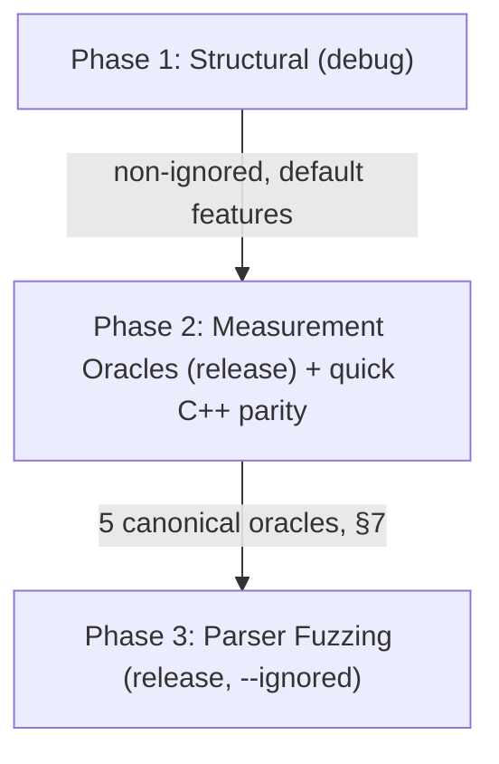

<!--
SPDX-License-Identifier: Apache-2.0
Copyright (c) 2026 Fábio Henrique de Lima Silva (fhl.bsb@gmail.com) All rights reserved.
-->

# Test Coverage Inventory

This document tracks and categorizes the test suite of `NeuralAmpModeler-rs` according to its required Cargo features and execution phases. Coverage is verified through typed capability receipts (`tests/models/receipt_test.rs` and `src/bin/capability_receipt.rs`), which produce a machine-readable inventory enumerating every model × sample-rate × ISA combination with its resolved status (`Available`, `Missing`, or `KnownGap`). Hardware-dependent tests (AVX-512, VNNI+BF16) self-skip via `is_x86_feature_detected!` and are explicitly tracked as `Skip(HardwareUnsupported)` in the receipt. This replaces blanket percentage claims with verifiable, per-entry coverage assertions tied to the fixture catalog.

> [!NOTE]
> **Document scope.** This document covers the *functional/correctness* `cargo test` architecture: [utils/tests-quick.sh](../utils/tests-quick.sh) (agile first line) and [utils/tests-long.sh](../utils/tests-long.sh) (nightly/pre-release audit). Static analysis ([utils/lints.sh](../utils/lints.sh)) and performance benchmarking are out of scope here:
>
> - [utils/tests-performance-regression.sh](../utils/tests-performance-regression.sh) is the canonical, baseline-gated performance-regression wall. Its full rationale, workflow, and troubleshooting live in [benchmarks.md](benchmarks.md) ("Regression Gate" section).
> - Benchmarks are executed via `cargo bench` or `utils/tests-performance-regression.sh` and are excluded from the nightly test runner ([utils/tests-long.sh](../utils/tests-long.sh)).

---

## 1. Crate Features Taxonomy

The `NeuralAmpModeler-rs` crate defines several features in [Cargo.toml](../Cargo.toml) to customize build targets and test capabilities:

| Feature Name         | Description                   | Active Dependencies / Modules          | Gated Scope                                                                                                              |
|:-------------------- |:----------------------------- |:-------------------------------------- |:------------------------------------------------------------------------------------------------------------------------ |
| **`testing`**        | Test utilities & generators   | Gated test modules & binary tools      | [src/testing/](../src/testing/), `gen_stress`, `wav_to_golden`                                                           |
| **`stereo`**         | Enable stereo DSP processing  | DSP input/output buffers               | [src/dsp/pipeline/stages/input.rs](../src/dsp/pipeline/stages/input.rs) (Stereo variants)                                |
| **`heap-audit`**     | Memory watchdog tracking      | Global `CountingAllocator` interceptor | [src/common/alloc_audit.rs](../src/common/alloc_audit.rs), [tests/rt_constraints/](../tests/rt_constraints/) heap checks |
| **`long_bench`**     | Extended criterion benchmarks | `long_inference_bench`                 | [benches/long_inference_bench.rs](../benches/long_inference_bench.rs) (benchmark cycles >30s)                            |
| **`dynamic-engine`** | A2 dynamic engine runtime     | A2 dynamic compute submodules          | [src/dsp/](../src/dsp/)                                                                                                  |

---

## 2. Test Execution Phase Architecture — Two-Axis Model

Test placement is governed by **two orthogonal axes**, not by a single "fast vs. slow" heuristic:

- **Axis A — Rigor (encoded via `#[ignore]`):** non-ignored = first line of defense (runs every sprint, several times a day); `#[ignore]` = long/rigorous (runs ~1×/day via `--ignored`). This is the *rigor* axis.
- **Axis B — Codegen Path (encoded via debug vs. `--release`):** structural tests (logic, parsers, FSM, bitwise determinism) run in **debug** (cheap, with `debug-assertions` ON, where float codegen is irrelevant); measurement oracles (anything comparing floats against a reference) run in **`--release`** (the codegen path users actually execute). Measuring in debug guards a "phantom" — codegen without `-O3`, without FMA contraction, without auto-vectorization.

The quick suite ([utils/tests-quick.sh](../utils/tests-quick.sh)) has three phases that respect both axes:



### Phase 1 — Structural (debug, default features)

- **Goal:** logic, parsers, FSM transitions, loaders, SPSC, bitwise determinism.
- **Scope:** `cargo test --lib` (unit, auto-discovered) + integration entry points ([tests/models.rs](../tests/models.rs), [tests/perf_soak.rs](../tests/perf_soak.rs), [tests/parity.rs](../tests/parity.rs), [tests/rt_constraints.rs](../tests/rt_constraints.rs), [tests/dsp_core.rs](../tests/dsp_core.rs), and [tests/target_features_compliance_test.rs](../tests/target_features_compliance_test.rs)).
- **Excluded by design** (via `--skip <module>::` module-prefix filters — exact module matches):
  - The measurement-oracle modules (→ Phase 2, release): `golden_vectors`, `cpp_parity`, `reference_oracle_f64`, `isa_parity`, `spectral_fidelity`, `linear_fft_test`. Running them in debug would both duplicate Phase 2 and measure a codegen "phantom" (Axis B, §7).
  - `rt_deadline` / `rt_jitter` (timing characterization → deferred to the long suite, Phases 4 and 5, release-only; asserting deadlines in debug is meaningless).
  - `proptest_parsers` (parser fuzzing → Phase 3, release `--ignored`).
- **Parallel execution safety:** Integration tests run in parallel by default (`--test-threads > 1`). Process-wide mutable state (such as activation mode precision in `src/math/activations/mod.rs`) is guarded by atomic state wrappers (`AtomicUsize`) and thread guards (`PrecisionGuard`, `REPORT_LOCK`).

### Phase 2 — Measurement Oracles (release, gate of production floats)

- **Goal:** the 5 canonical oracles of §7 measure the float path that ships.
- **Scope (combined into a single `cargo test` invocation per dependency branch to avoid recompiling multiple times):**
  - Always: `reference_oracle_f64` + `spectral_fidelity` + `linear_fft_test` (committed dependencies; mathematical oracle tests always run, C++ golden tests skip gracefully when goldens absent).
  - With committed goldens: `golden_vectors` (v1) + `isa_parity` (v2, requires `--test-threads=1` per §7; the others tolerate parallel execution).
  - With `NeuralAmpModelerCore`: `cpp_parity quick_parity` (separate invocation — the `quick_parity` filter would suppress other oracles if combined). Covers LSTM 1×16 (Fast + HF), WaveNet CH16 (Fast + HF), A2-Full, and ConvNet (note: ConvNet skips at runtime as C++ NAMCore render expects standard layout).
- **Prerequisites:** gracefully skipped if goldens or NAMCore dependencies are absent.

### Phase 3 — Parser Fuzzing (release, `--ignored`, capped)

- **Goal:** Tier 1 parser robustness and security verification.
- **Scope:** `proptest_parsers` with `PROPTEST_CASES=1000` (configurable via `NAM_QUICK_PROPTEST_CASES`). The long suite runs the full case counts (up to 100,000 cases).

### Heap Audits — delegated to the long suite

- Heap-audit integration tests run in [utils/tests-long.sh](../utils/tests-long.sh) Phase 3 in **release**. They are out of the quick loop.

### Golden Vector Supply Chain

Phase 2's `golden_vectors` (v1) and `isa_parity` (v2), and the long suite's `cpp_parity` full matrix and `golden_vectors` v2 multi-SR, compare against pre-committed `.bin` golden files rendered off-line by [tests/fixtures/golden_gen_build.sh](../tests/fixtures/golden_gen_build.sh) against pinned reference versions defined in [variables.env](../variables.env).

- **Golden Freshness Manifest:** [tests/fixtures/golden_gen_build.sh](../tests/fixtures/golden_gen_build.sh) commits a versioned `.golden_manifest.sha256` freshness manifest checked automatically by [utils/tests-quick.sh](../utils/tests-quick.sh) Phase 2. A `sha256sum`-based gate hard-fails if a `.nam` model is modified without regenerating the corresponding golden vector.

- **Model Resolution Order:** `golden_gen_build.sh` resolves `.nam` models through `resolve_nam_model()`, matching `src/testing/fixtures.rs::model_path`: (1) `$NAM_MODELS_DIR`, (2) `third-party/community_models/` (via `NAM_THIRD_PARTY_DIR`), (3) `tests/fixtures/models-nondist`, (4) `tests/fixtures/models`. See [tests/fixtures/README.md](../tests/fixtures/README.md) for skip semantics and non-distributable golden handling.

- **Libm Export Guard:** [utils/debug/verify_no_libm_exports.sh](../utils/debug/verify_no_libm_exports.sh) is a diagnostic ELF surface verification script that inspects compiled artifacts to confirm they do not export libm symbols with global/weak linkage, preventing runtime symbol interposition bugs (documented in [postmortem-libm-symbol-interposition.md](postmortem-libm-symbol-interposition.md)).

---

## 3. Test Coverage Matrix

The following table maps test modules across the integration entry points ([models](../tests/models.rs), [parity](../tests/parity.rs), [perf_soak](../tests/perf_soak.rs), [rt_constraints](../tests/rt_constraints.rs), [dsp_core](../tests/dsp_core.rs), and standalone targets):

| Test Module Target                                                                    | Entry Point      | Type        | Required Features | Quick Phase 1 (debug)     | Quick Phase 2 (release)  | Quick Phase 3 (release, ignored) | Long Suite                           | Verification Goal                                                                                                                          |
|:------------------------------------------------------------------------------------- |:---------------- |:----------- |:----------------- |:-------------------------:|:------------------------:|:--------------------------------:|:------------------------------------:|:------------------------------------------------------------------------------------------------------------------------------------------ |
| **`src/` (Core)**                                                                     | Core Lib         | Unit        | *None*            | **Yes**                   | No                       | No                               | No                                   | Core math, DSP kernels, model loaders (`loader::`), linear/wavenet/lstm logic                                                              |
| **[a2_loader](../tests/models/a2_loader.rs)**                                         | `models`         | Integration | *None*            | **Yes**                   | No                       | No                               | No                                   | Model verification for A2-Lite and A2-Full shapes and parameters                                                                           |
| **[activation_precision](../tests/models/activation_precision.rs)**                   | `models`         | Integration | *None*            | **Yes**                   | No                       | No                               | No                                   | Precision verification of WaveNet activation gain and scaling                                                                              |
| **[adaptive_fsm_proptest](../tests/models/adaptive_fsm_proptest.rs)**                 | `models`         | Integration | *None*            | **Yes** *(ignored)*       | No                       | No                               | **Yes** (Phase 2)                    | FSM state transitions under varying load and jitter scenarios                                                                              |
| **[block_invariance_test](../tests/models/block_invariance_test.rs)**                 | `models`         | Integration | *None*            | **Yes**                   | No                       | No                               | No                                   | Validates continuous output invariance across buffer block sizes 1..2048 for all supported catalog models                                  |
| **[cabsim_cpp_parity](../tests/parity/cabsim_cpp_parity.rs)**                         | `parity`         | Integration | *None*            | No                        | No                       | No                               | **Yes** (Phase 2)                    | Parity validation of CabSim convolution against C++ reference implementation                                                               |
| **[cabsim_golden](../tests/models/cabsim_golden.rs)**                                 | `models`         | Integration | *None*            | **Yes** *(ignored)*       | No                       | No                               | No                                   | Bitwise determinism of impulse response cab simulation                                                                                     |
| **[catalog_test](../tests/models/catalog_test.rs)**                                   | `models`         | Integration | *None*            | **Yes**                   | No                       | No                               | No                                   | Validates catalog registry counts (51 unique SHA-256 identities, 61 paths), alias mappings, and disk fixture presence                      |
| **[concurrency_stress](../tests/perf_soak/concurrency_stress.rs)**                    | `perf_soak`      | Integration | *None*            | **Yes**                   | No                       | No                               | —                                    | SPSC queues, multi-reader lock-free param smoothing under heavy contention                                                                 |
| **[container_slimmable](../tests/models/container_slimmable.rs)**                     | `models`         | Integration | *None*            | **Yes**                   | No                       | No                               | No                                   | Seamless 32ms crossfading during container submodel swaps                                                                                  |
| **[cpp_parity](../tests/parity/cpp_parity.rs)**                                       | `parity`         | Integration | *None*            | No                        | **Yes** (`quick_parity`) | No                               | **Yes** (Phase 2, ignored)           | Live parity checking of WaveNet (A1/A2) and LSTM models against C++ counterpart. Quick subset (6 tests/4 models) in Phase 2; full in long. |
| **[deterministic_energy_test](../tests/models/deterministic_energy_test.rs)**         | `models`         | Integration | *None*            | **Yes**                   | No                       | No                               | No                                   | Validates deterministic stress signal injection, finitude, and output RMS energy > -80 dBFS                                                |
| **[diagnostic_bundle](../tests/models/diagnostic_bundle.rs)**                         | `models`         | Integration | *None*            | **Yes**                   | No                       | No                               | No                                   | Capture and formatting of system diagnostics and telemetry                                                                                 |
| **[diagnostic_bundle](../tests/models/diagnostic_bundle.rs) (Heap)**                  | `models`         | Integration | `heap-audit`      | No                        | No                       | No                               | **Yes** (Phase 3)                    | Zero-alloc verification of diagnostic and telemetry operations                                                                             |
| **[doc_inventory](../tests/models/doc_inventory.rs)**                                 | `models`         | Integration | *None*            | **Yes**                   | No                       | No                               | **Yes** (Pre-flight, blocking)       | Meta-test scanning docs/ and utils/ for script references, feature flags, and source paths coherence (S8-E8-T03)                           |
| **[fixture_b1_2_smoke](../tests/models/fixture_b1_2_smoke.rs)**                       | `models`         | Integration | *None*            | **Yes**                   | No                       | No                               | No                                   | Smoke test for synthetic fixture model generation and integrity                                                                            |
| **[gate_fsm_proptest](../tests/models/gate_fsm_proptest.rs)**                         | `models`         | Integration | *None*            | No                        | No                       | No                               | **Yes** (Phase 2)                    | Property-based tests verifying the Gate finite state machine under load                                                                    |
| **[golden_vectors](../tests/models/golden_vectors.rs)**                               | `models`         | Integration | *None*            | No                        | **Yes** (v1)             | No                               | **Yes** (Phase 2, v2 ignored)        | Golden vector cross-validation of static and dynamic models against C++ reference. v1 (2048 samples) in Phase 2; v2 multi-SR in long.      |
| **[isa_parity](../tests/parity/isa_parity.rs)**                                       | `parity`         | Integration | *None*            | No                        | **Yes** (AVX2)           | No                               | **Yes** (Phase 2, AVX-512 ignored)   | ISA determinism: AVX2 self-consistency in Phase 2; full cross-ISA matrix in long.                                                          |
| **[linear_golden](../tests/models/linear_golden.rs)**                                 | `models`         | Integration | *None*            | **Yes** *(ignored)*       | No                       | No                               | **Yes** (Phase 2)                    | Bitwise output testing of linear (simplified) models                                                                                       |
| **[linear_fft_test](../tests/models/linear_fft_test.rs)**                             | `models`         | Integration | *None*            | No                        | **Yes**                  | No                               | No                                   | Partitioned convolution cross-validation (Linear FFT). Math oracle tests always run; C++ golden tests skip when goldens absent.            |
| **[loom_tests](../tests/loom_tests.rs)**                                              | Standalone       | Integration | `loom` (cfg)      | No                        | No                       | No                               | **Yes** (Phase 6)                    | Model-checking verification for lock-free concurrency primitives using `loom`                                                              |
| **[lstm_activation_precision](../tests/models/lstm_activation_precision.rs)**         | `models`         | Integration | *None*            | **Yes**                   | No                       | No                               | No                                   | Precision verification of LSTM activation gain and scaling                                                                                 |
| **[lstm_model_dyn_validation](../tests/models/lstm_model_dyn_validation.rs)**         | `models`         | Integration | *None*            | **Yes** *(ignored)*       | No                       | No                               | **Yes** (Phase 2)                    | Parity validation of LstmModelDyn: SIMD vs scalar, determinism, block-size invariance, zero-input edge cases, quantized head               |
| **[lstm_gate_bf16_parity](../tests/parity/lstm_gate_bf16_parity.rs)**                 | `parity`         | Integration | *None*            | No                        | No                       | No                               | **Yes** (Phase 2)                    | Parity verification of vectorized gemv 4-gate bf16 operations                                                                              |
| **[lstm_scalar_bf16_parity](../tests/parity/lstm_scalar_bf16_parity.rs)**             | `parity`         | Integration | *None*            | No                        | No                       | No                               | **Yes** (Phase 2)                    | Parity validation of scalar vs SIMD implementation for LSTM cells                                                                          |
| **[meta_coherence](../tests/models/meta_coherence.rs)**                               | `models`         | Integration | *None*            | **Yes**                   | No                       | No                               | **Yes** (Pre-flight, blocking)       | Meta-test asserting golden-catalog ↔ ignored-test model coherence before Phase 1 long suite execution                                      |
| **[metrics_jsonl_test](../tests/models/metrics_jsonl_test.rs)**                       | `models`         | Integration | *None*            | **Yes**                   | No                       | No                               | No                                   | Sanitization regression test ensuring JSONL metric generator never emits `null` for non-finite values                                      |
| **[mirror_buf_fault_injection](../tests/models/mirror_buf_fault_injection.rs)**       | `models`         | Integration | *None*            | **Yes**                   | No                       | No                               | No                                   | Verification of mmap mirror buffer error recovery and fault tolerance                                                                      |
| **[nam_infer_test](../tests/models/nam_infer_test.rs)**                               | `models`         | Integration | *None*            | **Yes**                   | No                       | No                               | No                                   | Computational stability of core models with variable block sizes                                                                           |
| **[namb_v2_roundtrip](../tests/models/namb_v2_roundtrip.rs)**                         | `models`         | Integration | *None*            | **Yes**                   | No                       | No                               | No                                   | Serialization and deserialization roundtrip testing of binary NAMB v2 files                                                                |
| **[namb_v2_validation](../tests/models/namb_v2_validation.rs)**                       | `models`         | Integration | *None*            | **Yes**                   | No                       | No                               | No                                   | Formatting and structure compliance validation of binary models                                                                            |
| **[nondist_validation](../tests/models/nondist_validation.rs)**                       | `models`         | Integration | *None*            | **Yes**                   | No                       | No                               | No                                   | Non-distributable model validation battery (parsing, determinism, block invariance, denormal silence)                                      |
| **[oversampling_characterization](../tests/models/oversampling_characterization.rs)** | `models`         | Integration | *None*            | No                        | No                       | No                               | On demand                            | Empirical ASR/ESR/MR-STFT measurements of LSTM models under 2×/4× oversampling. All tests `#[ignore]` (require model files).               |
| **[parity_primitives](../tests/parity/parity_primitives.rs)**                         | `parity`         | Integration | *None*            | **Yes**                   | No                       | No                               | No                                   | Parity verification of DSP primitives (tanh, sigmoid, convolution, dot product)                                                            |
| **[pipeline_soak](../tests/perf_soak/pipeline_soak.rs)**                              | `perf_soak`      | Integration | *None*            | No                        | No                       | No                               | **Yes** (Phase 1)                    | Multi-block pipeline soak testing under audio thread conditions                                                                            |
| **[prewarm_test](../tests/models/prewarm_test.rs)**                                   | `models`         | Integration | *None*            | **Yes**                   | No                       | No                               | No                                   | Verification of WaveNet/LSTM prewarm buffer correctness and zero-alloc guarantees                                                          |
| **[proptest_math](../tests/models/proptest_math.rs)**                                 | `models`         | Integration | *None*            | **Yes** (1 test)          | No                       | No                               | **Yes** (Phase 2, ignored)           | Mathematical invariants testing for AVX2/AVX512 SIMD functions                                                                             |
| **[proptest_parsers](../tests/models/proptest_parsers.rs)**                           | `models`         | Integration | *None*            | No                        | No                       | **Yes** (capped 1000)            | **Yes** (Phase 2, full)              | Robustness/fuzz testing of JSON and binary model parsers                                                                                   |
| **[receipt_test](../tests/models/receipt_test.rs)**                                   | `models`         | Integration | *None*            | **Yes**                   | No                       | No                               | No                                   | Validates typed capability receipt generation and invariants (51 canonical models)                                                         |
| **[reference_oracle_f64](../tests/parity/reference_oracle_f64.rs)**                   | `parity`         | Integration | *None*            | No                        | **Yes**                  | No                               | No                                   | f64 oracle decomposition — absolute precision vs mathematical ideal (§7, §8)                                                               |
| **[resampler_invariance_test](../tests/dsp_core/resampler_invariance_test.rs)**       | `dsp_core`       | Integration | *None*            | **Yes**                   | No                       | No                               | No                                   | Validates polyphase FIR sinc resampler block-size invariance and determinism across sample rate scenarios                                  |
| **[rt_deadline](../tests/rt_constraints/rt_deadline.rs)**                             | `rt_constraints` | Integration | *None*            | No                        | No                       | No                               | **Yes** (Phase 4, release)           | RT deadline gate — asserts p99 < 1.33 ms (release-only; meaningless in debug).                                                             |
| **[rt_jitter](../tests/rt_constraints/rt_jitter.rs)**                                 | `rt_constraints` | Integration | *None*            | No                        | No                       | No                               | **Yes** (Phase 5, ignored)           | RT jitter characterization under CPU contention (release-only; all tests `#[ignore]`).                                                     |
| **[self_consistency](../tests/models/self_consistency.rs)**                           | `models`         | Integration | *None*            | **Yes**                   | No                       | No                               | No                                   | Verification that models produce identical output across reset operations                                                                  |
| **[soak_test](../tests/perf_soak/soak_test.rs)**                                      | `perf_soak`      | Integration | *None*            | **Yes** *(1 non-ignored)* | No                       | No                               | **Yes** (Phase 1, ignored)           | Long-duration soak testing (10M+ frames). One decomposition test stays non-ignored; the rest run in long.                                  |
| **[spectral_fidelity](../tests/models/spectral_fidelity.rs)**                         | `models`         | Integration | *None*            | No                        | **Yes**                  | No                               | **Yes** (Phase 2, baselines ignored) | Spectral quality: ASR, Farina FR+THD, THD+N, IMD. Synthetic in Phase 2; per-model baselines in long.                                       |
| **[spsc_pipeline](../tests/perf_soak/spsc_pipeline.rs)**                              | `perf_soak`      | Integration | *None*            | **Yes**                   | No                       | No                               | No                                   | End-to-end testing of the lock-free SPSC pipeline model swapping                                                                           |
| **[target_features_compliance_test](../tests/target_features_compliance_test.rs)**    | Standalone       | Integration | *None*            | **Yes**                   | No                       | No                               | No                                   | Compile-time and runtime validation enforcing psABI x86-64-v3 target features baseline                                                     |
| **[thp_coherence](../tests/models/thp_coherence.rs)**                                 | `models`         | Integration | *None*            | **Yes**                   | No                       | No                               | No                                   | Transparent Huge Pages (THP) prctl configuration & system memory alignment coherence                                                       |
| **[threshold_calibration](../tests/models/threshold_calibration.rs)**                 | `models`         | Integration | *None*            | **Yes**                   | No                       | No                               | No                                   | Verification of calibrated noise/gate thresholds for reference models                                                                      |
| **[wavenet_clone_exact_test](../tests/models/wavenet_clone_exact_test.rs)**           | `models`         | Integration | *None*            | **Yes**                   | No                       | No                               | No                                   | Validates structural exact clone (`clone_exact`) and slimmable storage clone for heterogeneous channel geometries                          |
| **[wavenet_lite_block_invariance](../tests/models/wavenet_lite_block_invariance.rs)** | `models`         | Integration | *None*            | **Yes**                   | No                       | No                               | No                                   | Block-size invariance of WaveNet-lite output (determinism)                                                                                 |
| **[wavenet_prewarm_edge](../tests/models/wavenet_prewarm_edge.rs)**                   | `models`         | Integration | *None*            | **Yes**                   | No                       | No                               | No                                   | Edge-case verification of WaveNet pre-warm and receptive field samples                                                                     |
| **[zero_alloc_infer](../tests/models/zero_alloc_infer.rs)**                           | `models`         | Integration | *None* (TLS Mode) | **Yes**                   | No                       | No                               | No                                   | Proving zero-alloc of WaveNet, LSTM, and container transitions in TLS mode                                                                 |
| **[a2_heap_audit](../tests/rt_constraints/a2_heap_audit.rs)**                         | `rt_constraints` | Integration | `heap-audit`      | No                        | No                       | No                               | **Yes** (Phase 3)                    | Zero-alloc verification of WaveNet A2-Full/A2-Lite under CDYLIB                                                                            |
| **[cabsim_heap_audit](../tests/rt_constraints/cabsim_heap_audit.rs)**                 | `rt_constraints` | Integration | `heap-audit`      | No                        | No                       | No                               | **Yes** (Phase 3)                    | Zero-alloc verification of partition convolution under CDYLIB                                                                              |
| **[resampler_heap_audit](../tests/rt_constraints/resampler_heap_audit.rs)**           | `rt_constraints` | Integration | `heap-audit`      | No                        | No                       | No                               | **Yes** (Phase 3)                    | Zero-alloc verification of sinc-interpolation sample rate converters                                                                       |

---

## 4. Summary of Decoupled Audits (Long QA Suite)

Certain tests are marked as `#[ignore]` in the standard suite to keep execution times fast (~2 minutes). The core C++ parity, parser fuzzing, and SIMD precision gates run in Phase 2/3 of the quick QA suite. The remaining ignored tests are deferred to the nightly/pre-release auditing script ([utils/tests-long.sh](../utils/tests-long.sh)).

Before any timed phase, a **blocking pre-flight gate** runs [tests/models/meta_coherence.rs](../tests/models/meta_coherence.rs) — a fast check asserting that every `.nam` model referenced by an `#[ignore]`d golden test is registered in [tests/fixtures/golden_gen_build.sh](../tests/fixtures/golden_gen_build.sh)'s CATALOG.

The battery itself runs in 7 sequential phases:

1. **Soak Tests (Numerical Stability)**: Long endurance runs (10M+ frames) of DSP/model inference under continuous feed to identify leaks or buffer drifts ([tests/perf_soak/soak_test.rs](../tests/perf_soak/soak_test.rs), [tests/perf_soak/pipeline_soak.rs](../tests/perf_soak/pipeline_soak.rs)).
2. **Property-Based, FSM, Parity, Golden Vectors & Cross-ISA in Release**: Full-count proptests and fuzzing ([tests/models/proptest_parsers.rs](../tests/models/proptest_parsers.rs), [tests/models/proptest_math.rs](../tests/models/proptest_math.rs), [tests/parity/lstm_gate_bf16_parity.rs](../tests/parity/lstm_gate_bf16_parity.rs), [tests/parity/lstm_scalar_bf16_parity.rs](../tests/parity/lstm_scalar_bf16_parity.rs), [tests/models/gate_fsm_proptest.rs](../tests/models/gate_fsm_proptest.rs), [tests/models/adaptive_fsm_proptest.rs](../tests/models/adaptive_fsm_proptest.rs), [tests/models/lstm_model_dyn_validation.rs](../tests/models/lstm_model_dyn_validation.rs)); full C++ parity and golden validation ([tests/parity/cpp_parity.rs](../tests/parity/cpp_parity.rs) full matrix, [tests/parity/cabsim_cpp_parity.rs](../tests/parity/cabsim_cpp_parity.rs), [tests/models/golden_vectors.rs](../tests/models/golden_vectors.rs) v2 multi-SR, [tests/models/linear_golden.rs](../tests/models/linear_golden.rs)); full cross-ISA matrix ([tests/parity/isa_parity.rs](../tests/parity/isa_parity.rs), AVX-512/VNNI-BF16, self-skipping per model when unsupported); per-model spectral fidelity baselines ([tests/models/spectral_fidelity.rs](../tests/models/spectral_fidelity.rs)); Tier-3 approx-vs-approx consistency checks; pipeline block-size proptest; gate envelope continuity proptest; and recurrent state drift diagnostics.
3. **RT-Safety Heap-Audit (release, `heap-audit`)**: Zero-alloc verification under the `heap-audit` global allocator — resampler, cabsim, A2, and the `diagnostic_bundle` heap variant ([tests/rt_constraints/resampler_heap_audit.rs](../tests/rt_constraints/resampler_heap_audit.rs), [tests/rt_constraints/cabsim_heap_audit.rs](../tests/rt_constraints/cabsim_heap_audit.rs), [tests/rt_constraints/a2_heap_audit.rs](../tests/rt_constraints/a2_heap_audit.rs)).
4. **RT Deadline Gate (deterministic)**: Absolute latency ceiling — `assert!(p99 < 1.33 ms)` for every model SKU ([tests/rt_constraints/rt_deadline.rs](../tests/rt_constraints/rt_deadline.rs), release, non-ignored).
5. **RT Jitter Characterization (environmental telemetry)**: Tail latency under CPU contention ([tests/rt_constraints/rt_jitter.rs](../tests/rt_constraints/rt_jitter.rs), release, `--ignored`). Diagnostic only — may report `INCONCLUSIVE` or `SKIP_CAPABILITY` when environment preconditions (CPU pinning, performance governor) are not met.
6. **Loom Concurrency Model Checking (release, `--cfg loom`)**: Model-checks SPSC/GC/DspBridge lock-free primitives under loom's exhaustive permutation engine ([tests/loom_tests.rs](../tests/loom_tests.rs)).

---

## 5. Ignored Tests Mapping Matrix

The following table documents all ignored tests in the repository, explaining why they are gated from standard CI, where they run, and their execution frequency:

| Test/Suite Target                                                                | Ignored Tests / Scope                                                                                                  | Reason for `#[ignore]`                                                                                                                                                                                                                                                                                                                                | Suite Execution                                            | Frequency             |
|:-------------------------------------------------------------------------------- |:---------------------------------------------------------------------------------------------------------------------- |:----------------------------------------------------------------------------------------------------------------------------------------------------------------------------------------------------------------------------------------------------------------------------------------------------------------------------------------------------- |:---------------------------------------------------------- |:--------------------- |
| **[soak_test.rs](../tests/perf_soak/soak_test.rs)**                              | `test_*_soak`, `test_*_endurance`                                                                                      | Extended duration execution (>1 hour) to find memory leaks or buffer drift.                                                                                                                                                                                                                                                                           | Long Suite (Phase 1)                                       | Pre-release / Nightly |
| **[pipeline_soak.rs](../tests/perf_soak/pipeline_soak.rs)**                      | `test_pipeline_soak_*`                                                                                                 | Endurance testing of full audio thread capture-DSP-bridge pipeline.                                                                                                                                                                                                                                                                                   | Long Suite (Phase 1)                                       | Pre-release / Nightly |
| **[proptest_parsers.rs](../tests/models/proptest_parsers.rs)**                   | `prop_fuzz_*` (all 14, incl. `prop_fuzz_nam_json_arbitrary_bytes`)                                                     | Adversarial fuzz testing of JSON and binary model parsers with up to 100k test cases.                                                                                                                                                                                                                                                                 | Quick Phase 3 (capped 1000), Long Suite (Phase 2, full)    | Per-commit, Nightly   |
| **[proptest_math.rs](../tests/models/proptest_math.rs)**                         | `prop_*` (3 ignored; 1 non-ignored `prop_simd_tanh_avx2_rmse`)                                                         | Mathematical invariant fuzz testing for AVX2/AVX512 SIMD kernels. Non-ignored test runs in Phase 1; ignored in long.                                                                                                                                                                                                                                  | Quick Phase 1 (1 test), Long Suite (Phase 2, ignored)      | Per-commit, Nightly   |
| **`src/math/activations/{tanh,sigmoid}/`**                                       | `test_tanh_poly_nr*_vs_div_*`, `test_sigmoid_poly_*_sweep`, `test_pade_nr*_*`, `test_pade_nr1_dual_vs_production_avx2` | Relative consistency only (approx vs approx, no ground truth). f64 Oracle provides absolute correctness.                                                                                                                                                                                                                                              | Long Suite (Phase 2)                                       | Nightly               |
| **`src/dsp/gate_test.rs`**                                                       | `gate_envelope_continuity_on_reversal`                                                                                 | 10,000-case proptest of the DynamicHysteresis FadingOut/FadingIn reversal edge case — too slow for daily loop at full case count.                                                                                                                                                                                                                     | Long Suite (Phase 2)                                       | Nightly               |
| **[lstm_gate_bf16_parity.rs](../tests/parity/lstm_gate_bf16_parity.rs)**         | `prop_*`                                                                                                               | Fuzz testing of SIMD gate bf16 calculations.                                                                                                                                                                                                                                                                                                          | Long Suite (Phase 2)                                       | Pre-release / Nightly |
| **[lstm_scalar_bf16_parity.rs](../tests/parity/lstm_scalar_bf16_parity.rs)**     | `prop_*`                                                                                                               | Fuzz testing of scalar vs SIMD bf16 calculations.                                                                                                                                                                                                                                                                                                     | Long Suite (Phase 2)                                       | Pre-release / Nightly |
| **[gate_fsm_proptest.rs](../tests/models/gate_fsm_proptest.rs)**                 | `prop_*`                                                                                                               | Fuzz testing of Gate FSM states under varying loads and jitter.                                                                                                                                                                                                                                                                                       | Long Suite (Phase 2)                                       | Pre-release / Nightly |
| **[adaptive_fsm_proptest.rs](../tests/models/adaptive_fsm_proptest.rs)**         | `test_adaptive_fsm_*`                                                                                                  | Property-based sweeps verifying the Adaptive Compute FSM transitions under jitter and overload.                                                                                                                                                                                                                                                       | Long Suite (Phase 2)                                       | Pre-release / Nightly |
| **[lstm_model_dyn_validation.rs](../tests/models/lstm_model_dyn_validation.rs)** | `test_model_dyn_proptest_scalar_simd_parity`, `test_model_dyn_proptest_quantized_head_parity`                          | Proptest of arbitrary (layers × hidden-size) topologies — too slow for daily loop; non-ignored tests cover fixed-shape cases.                                                                                                                                                                                                                         | Long Suite (Phase 2)                                       | Pre-release / Nightly |
| **`src/dsp/pipeline/pipeline_block_test.rs`**                                    | `test_random_block_sizes_proptest`                                                                                     | Proptest sweeping random buffer block sizes to find potential out-of-bounds/resampling issues.                                                                                                                                                                                                                                                        | Long Suite (Phase 2)                                       | Pre-release / Nightly |
| **[cpp_parity.rs](../tests/parity/cpp_parity.rs)**                               | `live_cross_validation_*` (full matrix)                                                                                | Compiles and runs live comparisons against C++ toolchain. The `quick_parity` subset (6 tests/4 models) runs in Phase 2.                                                                                                                                                                                                                               | Quick Phase 2 (`quick_parity`), Long Suite (Phase 2, full) | Per-commit, Nightly   |
| **[cpp_parity.rs](../tests/parity/cpp_parity.rs)**                               | `live_cross_validation_*_lite`                                                                                         | Requires non-distributable community model `EVH-5150-Lite.nam` (CH=12, SNR ≥ 105 dB).                                                                                                                                                                                                                                                                 | None                                                       | On-demand             |
| **[cabsim_cpp_parity.rs](../tests/parity/cabsim_cpp_parity.rs)**                 | `cross_validate_cabsim_cpp_*`                                                                                          | Live convolution validation against NeuralAmpModelerCore C++ convolution engine.                                                                                                                                                                                                                                                                      | Long Suite (Phase 2)                                       | Pre-release / Nightly |
| **[cabsim_golden.rs](../tests/models/cabsim_golden.rs)**                         | `test_cabsim_golden_long`, `test_cabsim_golden_stress`                                                                 | Heavy IR golden parity tests — too slow for daily loop at full length.                                                                                                                                                                                                                                                                                | Long Suite (Phase 2)                                       | Pre-release / Nightly |
| **[reference_oracle_f64.rs](../tests/parity/reference_oracle_f64.rs)**           | `test_*_a2_generic`, `t33_diagnostic_recurrent_drift_lstm_1x16`                                                        | Model disabled or diagnostic drift check.                                                                                                                                                                                                                                                                                                             | None                                                       | On-demand             |
| **[golden_vectors.rs](../tests/models/golden_vectors.rs)**                       | `test_golden_vectors_v2_*` (except lite)                                                                               | Long 5-second multi-SR golden comparison files (up to 960k samples per test).                                                                                                                                                                                                                                                                         | Long Suite (Phase 2)                                       | Pre-release / Nightly |
| **[golden_vectors.rs](../tests/models/golden_vectors.rs)**                       | `test_golden_vectors_wavenet_lite`                                                                                     | Non-ignored; runs in Phase 2 (v1 golden). Conditioned on presence of `golden_wavenet_lite.bin`.                                                                                                                                                                                                                                                       | **Yes** (Phase 2)                                          | Per-commit            |
| **[golden_vectors.rs](../tests/models/golden_vectors.rs)**                       | `test_golden_vectors_v2_wavenet_lite`                                                                                  | Requires non-distributable community model `EVH-5150-Lite.nam` + multi-SR golden files (5 s × 5 SR).                                                                                                                                                                                                                                                  | None                                                       | On-demand             |
| **[linear_golden.rs](../tests/models/linear_golden.rs)**                         | `test_linear_golden_long`, `test_linear_golden_stress`                                                                 | Heavy receptive-field (128/512-tap) golden regression — too slow for daily loop at full size.                                                                                                                                                                                                                                                         | Long Suite (Phase 2)                                       | Pre-release / Nightly |
| **[isa_parity.rs](../tests/parity/isa_parity.rs)**                               | `isa_parity_*_avx2_vs_avx512`, `isa_parity_*_avx2_vs_vnnibf16`, `isa_parity_hf_*` (12 total)                           | Requires AVX-512 / VNNI+BF16 hardware; self-skips per model via `is_x86_feature_detected!` when unsupported.                                                                                                                                                                                                                                          | Long Suite (Phase 2)                                       | Pre-release / Nightly |
| **[spectral_fidelity.rs](../tests/models/spectral_fidelity.rs)**                 | `model_baselines::baseline_*` (12 models)                                                                              | Per-model ASR/THD+N/IMD/Farina comparison against committed fixture — full model battery too slow for daily loop.                                                                                                                                                                                                                                     | Long Suite (Phase 2)                                       | Pre-release / Nightly |
| **[spectral_fidelity.rs](../tests/models/spectral_fidelity.rs)**                 | `generate_spectral_fidelity_baseline`                                                                                  | Regenerates committed baseline fixture. Strictly manual; excluded from the long suite via `spectral_fidelity::model_baselines::baseline_*` module-path filter + explicit `--skip generate_spectral_fidelity_baseline`. Trigger on demand: `cargo test --test models spectral_fidelity::generate_spectral_fidelity_baseline -- --ignored --nocapture`. | None                                                       | On-demand             |
| **[concurrency_stress.rs](../tests/perf_soak/concurrency_stress.rs)**            | `test_*_concurrent_*`, `test_t6_3_*`                                                                                   | Heavy multi-reader lock-free param contention sweeps.                                                                                                                                                                                                                                                                                                 | Quick Phase 1 (ignored)                                    | Per-commit / Nightly  |
| **[rt_jitter.rs](../tests/rt_constraints/rt_jitter.rs)**                         | `test_jitter_*` (all 4 — baseline, stress-1/2, saturate)                                                               | RT jitter characterization under CPU contention; timing meaningful only in release.                                                                                                                                                                                                                                                                   | Long Suite (Phase 5, `--ignored`)                          | Pre-release / Nightly |

---

## 6. Fail-Fast vs. Complete View Policy

To align test execution with developer workflows and integration schedules, the test suites implement two different error-handling strategies:

### 6.1. Fail-Fast (Standard QA Suite)

- **Script**: [utils/tests-quick.sh](../utils/tests-quick.sh)
- **Goal**: Minimize the feedback loop during local iterations and pre-commit checks.
- **Behavior**: If any test target compilation, test execution, or validation step fails, execution immediately terminates (`set -e`).
- **Configuration**: Standard bash fail-fast behavior with error traps reporting line number and failing command.

### 6.2. Complete View (Long-Duration Audit Suite)

- **Script**: [utils/tests-long.sh](../utils/tests-long.sh)
- **Goal**: Provide a complete, comprehensive report of all test, parity, and performance outcomes for nightlies or release gates.
- **Behavior**: Execution continues across all phases even if individual targets fail. Logs are collected and a final status summary table is generated.
- **Configuration**: Phase wrappers use error isolation (`|| true`) and cargo invocations pass `--no-fail-fast`. Script exits with status `1` at the end if any phase logged an error.

---

## 7. Measurement & Perceptual Validation Framework

The project includes a comprehensive measurement framework for audio fidelity assessment, documented in detail in [perceptual_validation.md](perceptual_validation.md).

### Measurement Integration with the Test Suite

| Test Target                 | Metrics Used                                           |
|:--------------------------- |:------------------------------------------------------ |
| **`cpp_parity`**            | ESR, SNR, PSNR, Fidelity Report (MSE, MAE, anchor SNR) |
| **`golden_vectors`**        | ESR (per-model calibrated thresholds), MSE, SNR        |
| **`isa_parity`**            | ESR cross-ISA budgets, self-consistency MSE=0          |
| **`spectral_fidelity`**     | ASR, Farina FR+THD, THD+N (AES17), IMD (SMPTE)         |
| **`reference_oracle_f64`**  | ESR (f64 vs f32, decomposition by error source)        |
| **`threshold_calibration`** | Per-model ESR/SNR thresholds, Fidelity Margin          |

### Key Concepts

- **Two references:** Parity (C++ NAMCore f32) measures implementation agreement; absolute (f64 Oracle) measures intrinsic quality loss from f32 approximations.
- **ESR as primary gate:** Normalizes error by reference energy — invariant to linear scale mismatch.
- **ISA parity:** End-to-end cross-ISA determinism via `TEST_ISA_OVERRIDE`. Self-consistency asserts bit-exact output; cross-ISA asserts ESR within calibrated budgets. Full cross-ISA matrix (AVX-512/VNNI+BF16) and per-model spectral baselines are long-suite only (`#[ignore]`d in quick); quick covers AVX2 self-consistency + synthetic spectral.
- **MR-STFT dual gate:** Hard gate at 44.1/48 kHz (`mrstft_max` calibrated per model); soft informational gate at higher sample rates (88.2–192 kHz).
- **RT-safety:** All metrics run off-RT. Hot-path audio processing uses sample-peak detection only.

---

## 8. Test Value Hierarchy

This section establishes which categories of tests provide genuine quality guarantees versus which serve as regression locators or consistency checks.

### Three Independent Oracles

The suite maintains three reference systems that answer complementary questions:

| Oracle                | Source                         | Question Answered                                                        | Status                                                                       |
|:--------------------- |:------------------------------ |:------------------------------------------------------------------------ |:---------------------------------------------------------------------------- |
| **NAMCore f32**       | `cpp_parity`, `golden_vectors` | Does our output match the reference player? (interop)                    | ✅ Complete                                                                  |
| **f64 Oracle**        | `reference_oracle_f64`         | How far from mathematical ideal, and which source dominates? (precision) | ✅ Structurally correct — LSTM/WaveNet/A2 functional; f16c residual expected |
| **ISA Parity Matrix** | `isa_parity`                   | Do all CPU ISAs produce consistent results? (determinism)                | ✅ CI: AVX2 self-consistency; long-suite: cross-ISA                          |

### Tier Classification

| Tier    | Category                                                      | Tests           | Guarantee                                                  | CI Placement                       |
|:-------:|:------------------------------------------------------------- |:--------------- |:---------------------------------------------------------- |:---------------------------------- |
| **1🔴** | NAMCore parity (`golden_vectors` + `cpp_parity`)              | ~70 non-ignored | Interop with the NAM ecosystem                             | Phase 2 + Long                     |
| **1🔴** | RT-safety (heap-audit, zero-alloc)                            | ~20             | No heap allocation on the audio thread                     | Long (Phase 3)                     |
| **1🔴** | Parser robustness (`namb`/`nam_json` fuzz, CRC)               | ~60             | Security and format integrity                              | Phase 3 + Phase 1                  |
| **2🟠** | Spectral quality (ASR, Farina FR+THD, THD+N AES17, IMD SMPTE) | ~30             | Aliasing and distortion fingerprint                        | Phase 2                            |
| **2🟠** | Activation correctness (vs `f32::tanh` / `f64::tanh`)         | ~15             | Approximation within specification                         | Phase 1                            |
| **2🟠** | f64 Oracle, ISA parity, RT deadline                           | ~35             | Absolute precision + cross-ISA + latency budget            | Quick Phase 2 + Long (Phases 2, 4) |
| **3🟡** | Kernel `avx2_vs_scalar` (dot, GEMV, conv)                     | ~60             | Regression **locators** — narrow down where failures occur | Phase 1                            |
| **3🟡** | Approx-vs-approx (`nr1_vs_div`, `nr2_vs_nr1`, etc.)           | ~10             | **Relative consistency only** — not correctness            | Long Suite (Phase 2)               |
| **3🟡** | Proptests (mathematical invariants, FSM sweeps)               | ~25             | Stochastic exploration of edge cases                       | Phase 1 + Long Suite               |

### Correctness vs. Consistency

- **Tier 2 (CI gate):** Tests comparing against a mathematical ground truth (`f32::tanh`, `f64::tanh`, analytical values) answer "is the approximation correct?".
- **Tier 3 (Long suite):** Tests comparing two approximations against each other (`Padé+NR1 vs Padé+div`, `nr2_vs_nr1`) verify agreement between approximations. With the f64 Oracle providing absolute precision, these run in the long suite for regression location.

---

## 9. Quality Contract (Contrato de Qualidade)

The **Quality Contract** establishes an immutable baseline freezing quality and performance targets to prevent silent regressions.

### 9.1. Architecture

The contract is enforced by [utils/quality-dashboard.sh](../utils/quality-dashboard.sh):

| Mode                | Command                                          | Function                                                                             |
|:------------------- |:------------------------------------------------ |:------------------------------------------------------------------------------------ |
| **Dashboard**       | `./utils/quality-dashboard.sh`                   | Executes all fidelity and performance phases and displays the interactive dashboard. |
| **Save (baseline)** | `./utils/quality-dashboard.sh --save <arquivo>`  | Saves plain-text dashboard results as the official baseline.                         |
| **Check (verify)**  | `./utils/quality-dashboard.sh --check <arquivo>` | Executes phases and compares current results against baseline, reporting violations. |

The dashboard's defense functions (metric sanitization, toolchain fingerprint,
JSONL parsing, test-execution assertion, and the golden-freshness gate) are covered by
a stable Bash unit-test suite: [utils/tests/test_scripts.sh](../utils/tests/test_scripts.sh).
Run it with `bash utils/tests/test_scripts.sh`; it exits 0 only when every assertion passes.

The official baseline resides in [docs/quality-contract.txt](quality-contract.txt).

### 9.2. Tolerance Margins

The `--check` mode separates measurement noise from real regressions:

| Metric                         | Failure Criterion                                                                                                                                   | Justification                                                                |
|:------------------------------ |:--------------------------------------------------------------------------------------------------------------------------------------------------- |:---------------------------------------------------------------------------- |
| **Fidelity — ESR**             | Per-SKU noise envelope (PERF-009): roughly `noise_limit = max(baseline×3, baseline+5e-14)` and a higher safety ceiling; not a global 10× multiplier | Catches subtle 2×–5× ESR regressions on ultra-precise models                 |
| **Fidelity — SNR (dB)**        | `new_snr < contract_snr − 6.0`                                                                                                                      | Quantization / scheduling margin                                             |
| **Fidelity — MR-STFT**         | Envelope / relative ceiling vs contract                                                                                                             | Spectral variance margin                                                     |
| **Oracle divergence**          | `REVIEW_REQUIRED` when NAMCore and f64 move in opposite directions beyond calibrated ratios                                                         | Neither oracle auto-wins                                                     |
| **Performance — Latency (µs)** | Contract: `new_lat > contract_lat × 1.10`. Primary gate: Criterion t-test via `tests-performance-regression.sh`                                     | 10% contract margin absorbs OS noise; Criterion is the statistical authority |

> [!NOTE]
> Fields with value `N/A` in the contract file are skipped during check.
> When `regression_gate != PASS`, the dashboard reports `PERFORMANCE: NOT_VERIFIED`
> and refuses to certify contract performance metrics (fail-closed; no stale log reuse).
>
> [!IMPORTANT]
> [utils/tests-performance-regression.sh](../utils/tests-performance-regression.sh) remains the **primary statistical authority** for performance regressions (two-sample t-test vs Criterion baseline under `.performance-baselines/`, p < 0.05). The quality contract is the integrated second line (fidelity + median latency snapshot).

### 9.3. Performance Regression vs. Fidelity Violation

Latency violations do **not** imply audio quality degradation or loss of parity with NAMCore. The test and verification pipeline explicitly decouples the fidelity domain (ESR, SNR, MR-STFT, f64 oracle) from the performance domain (latency in µs, CPU cycle budget). Both are critical, but address distinct underlying causes:

- **Fidelity Failure** (ESR/SNR/MR-STFT envelope violated) is a *hard gate*: it indicates a numerical divergence from the C++ reference or audible spectral distortion.
- **Performance Regression** (latency exceeding contract thresholds) indicates that inference is slower than the baseline *on the current hardware environment*, but does not alter the sonic output. This may stem from thermal throttling, CPU governor state, operating system scheduling jitter, or structural changes to code paths.

QA scripts report these domains independently:

- `FIDELITY: OK` / `PERFORMANCE: NOT_VERIFIED` — all fidelity phases and ESR/SNR envelopes passed; only `regression_gate` failed or was skipped (Criterion noise, missing baseline, or incomparable environment). This is **not** a sonic regression.
- `FIDELITY: FAIL` / `PERFORMANCE: *` — at least one mandatory fidelity phase or metric envelope failed. Investigate audio parity first.
- A `regression_gate` failure must **never** be counted as a fidelity violation (the quality dashboard's `verify_contract` attributes phase failures strictly by domain).

> [!NOTE]
> [utils/tests-performance-regression.sh](../utils/tests-performance-regression.sh) remains the primary statistical authority for performance regressions (two-sample t-test, p < 0.05); the quality contract acts as an integrated second line of defense.

### 9.4. Daily Workflow

```sh
# Run full quality check against baseline contract
./utils/quality-dashboard.sh --check docs/quality-contract.txt

# Run primary performance regression wall
./utils/tests-performance-regression.sh --check
```

### 9.5. Baseline Renewal Procedure (Human-Only)

Two artifacts must stay aligned after intentional performance or fidelity changes:

| Artifact                       | Location                                | Owner command                                                 |
| ------------------------------ | --------------------------------------- | ------------------------------------------------------------- |
| Criterion statistical baseline | `.performance-baselines/` (gitignored)  | `utils/tests-performance-regression.sh --bootstrap-baseline`  |
| Quality contract snapshot      | `docs/quality-contract.txt` (committed) | `utils/quality-dashboard.sh --save docs/quality-contract.txt` |

**Agents/CI must never run bootstrap or `--save`.** Operator machine: governor
`performance`, low load, optional `NAM_BENCH_CORE`.

```sh
# 1) Preconditions (fidelity / structure)
utils/lints.sh
utils/tests-quick.sh   # at most once as final structural gate

# 2) Renew Criterion baseline FIRST (absorbs intentional latency shifts)
utils/tests-performance-regression.sh --bootstrap-baseline
utils/tests-performance-regression.sh --check   # MUST exit 0

# 3) Freeze integrated contract (fails closed if regression_gate != PASS)
utils/quality-dashboard.sh --save docs/quality-contract.txt

# 4) Verify on the same revision
utils/quality-dashboard.sh --check docs/quality-contract.txt
```

**Provenance:** the saved contract header records `git_commit`, dirty/clean state,
`run_id`, `effective_isa` (full x86-64-v3 label), CPU, and rustc. Prefer a **clean**
git tree before `--save` so the commit hash is unambiguous.

**Flaky Criterion after a green standalone `--check`:** the dashboard runs fidelity
phases for ~minutes before Criterion, so micro-benches can trip p&lt;0.05 noise
(e.g. `RT_LSTM_2x8` +3–5% with no code change). Re-run standalone `--check` cold;
bootstrap again only if the delta is intentional or reproducible under isolation.
See [benchmarks.md — First-Time Setup and Post-Optimization Renewal](benchmarks.md#first-time-setup-and-post-optimization-renewal-human-only).

1. **Commit** `docs/quality-contract.txt` (and any related docs) with measured
   before/after numbers. Do **not** commit `.performance-baselines/` (local,
   machine-specific). Each developer/CI host bootstraps its own Criterion baseline.
