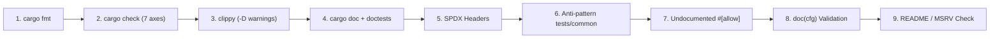
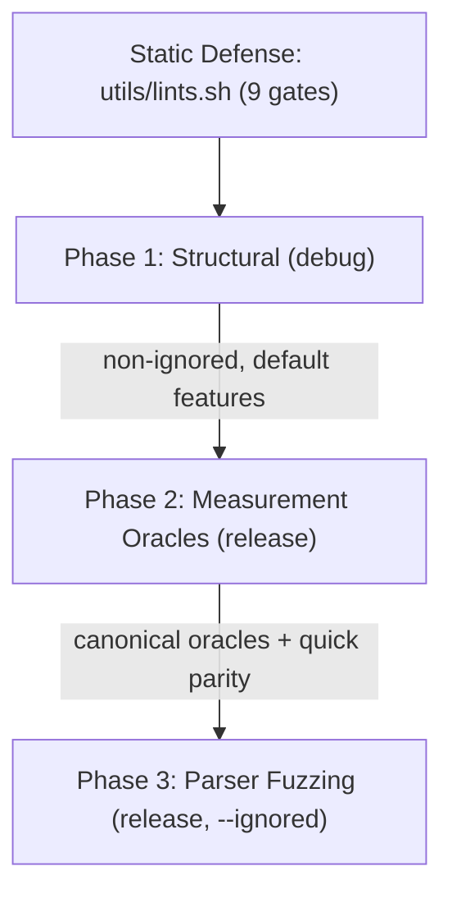

<!--
SPDX-License-Identifier: Apache-2.0
Copyright (c) 2026 Fábio Henrique de Lima Silva (fhl.bsb@gmail.com) All rights reserved.
-->

# Test Architecture

This document defines the organization, execution tiers, and validation principles of the test and static defense suite for `NeuralAmpModeler-rs`. The executable code (`tests/`, `src/**/*_test.rs`) and typed receipts are the primary source of truth.

> [!NOTE]
> **Document Scope & Hierarchy:**
>
> - **Static Analysis & Quality Defense:** Static validation across all feature axes, Clippy, doc-tests, and policy checks via [utils/lints.sh](../utils/lints.sh) (§2).
> - **Functional & Correctness Architecture:** Automated test architecture, feature gating, execution phases, and oracle validation via [utils/tests-quick.sh](../utils/tests-quick.sh) and [utils/tests-long.sh](../utils/tests-long.sh) (§3–§6).
> - **Manual Testing & Human Release Certification:** Step-by-step developer functional verification (Tiers 1–3) and the 5-receipt human release certification protocol reside in [functional-tests.md](functional-tests.md).
> - **Performance Regression Gates:** The statistical Criterion benchmarking wall and baseline governance reside in [benchmarks.md](benchmarks.md).
> - **Fixtures & Golden Vectors:** Ground-truth vector generation, model resolution order, and hash manifests reside in [fixtures.md](fixtures.md).
> - **Acoustic & Perceptual Validation:** Metric formulations (ESR, SNR, MR-STFT, THD+N) and perceptual calibration thresholds reside in [perceptual_validation.md](perceptual_validation.md).

---

## 1. Crate Features Taxonomy

The `NeuralAmpModeler-rs` crate defines several features in [Cargo.toml](../Cargo.toml) to configure runtime targets, test capabilities, and diagnostic facilities:

| Feature Name             | Default | Description                          | Active Scope & Modules                                                                                                   |
|:------------------------ |:-------:|:------------------------------------ |:------------------------------------------------------------------------------------------------------------------------ |
| **`dual-mono`**          | Yes     | Independent dual-channel inference   | [src/dsp/pipeline/stages/input.rs](../src/dsp/pipeline/stages/input.rs) (Stereo/dual-mono DSP variants)                  |
| **`testing`**            | No      | Test utilities, signals & generators | [src/testing/](../src/testing/), CLI binaries (`nam_golden_catalog`, `nam_freshness`, `nam_long_receipt`, etc.)          |
| **`heap-audit`**         | No      | Memory allocation interceptor        | [src/common/alloc_audit.rs](../src/common/alloc_audit.rs), [tests/rt_constraints/](../tests/rt_constraints/) heap checks |
| **`fft-radix4-planner`** | No      | Radix-4 FFT benchmark planner        | [benches/fft_radix4_bench.rs](../benches/fft_radix4_bench.rs) (Radix-4 DIT FFT planning routines)                        |
| **`avx512`**             | No      | Research/measurement AVX-512 kernels | [src/math/activations/](../src/math/activations/), SIMD dispatch tables                                                  |
| **`rt-hardening`**       | No      | Real-time OS host tuning (Linux)     | [src/rt_hardening/](../src/rt_hardening/) (THP, mlockall, SCHED_FIFO, DAZ/FTZ, IRQ affinity)                             |

---

## 2. Static Analysis & Quality Defense (`utils/lints.sh`)

[`utils/lints.sh`](../utils/lints.sh) is the **static first line of defense** of the project. It runs quickly (~45 seconds) and acts as an uncompromising quality gate that developers should execute regularly during active coding, before staging any commit, and as Receipt #1 in formal release certification.

Unlike test runners, `lints.sh` does not evaluate numerical audio outputs. Instead, it statically proves compilation cleanliness, zero-warning compliance, documentation hygiene, and policy conformance across the entire feature matrix.

### 2.1 The 9 Sequential Verification Gates


```mermaid
graph LR
    L1["1. cargo fmt"] --> L2["2. cargo check (7 axes)"]
    L2 --> L3["3. clippy (-D warnings)"]
    L3 --> L4["4. cargo doc + doctests"]
    L4 --> L5["5. SPDX Headers"]
    L5 --> L6["6. Anti-pattern tests/common"]
    L6 --> L7["7. Undocumented #[allow]"]
    L7 --> L8["8. doc(cfg) Validation"]
    L8 --> L9["9. README / MSRV Check"]
```

1. **`[1/9] In-Place Formatting (cargo fmt):`**
   Runs `cargo fmt --all` to enforce standard formatting across library code, binaries, examples, benches, and tests.
2. **`[2/9] Dynamic Compilation Matrix (cargo check):`**
   Verifies that the codebase compiles cleanly across 7 distinct feature axes, preventing hidden breakages behind conditional compilation:
   - Catch-all: `--all-targets --all-features`
   - Pure minimal core: `--lib --no-default-features`
   - All targets without defaults: `--all-targets --no-default-features`
   - Individual feature permutations: `fft-radix4-planner`, `dual-mono`, `testing`, `heap-audit`, and `rt-hardening`.
3. **`[3/9] Strict Static Analysis (cargo clippy):`**
   Executes Clippy across the same 7 feature permutations with `-D warnings`. Fails on any compiler or Clippy warning, dead code, or unidiomatic construct.
4. **`[4/9] Documentation & Doc-Tests (cargo doc + cargo test --doc):`**
   Builds full rustdoc documentation (`cargo doc --no-deps`) with zero warnings under `--all-features`, and executes every documentation test example in public APIs and README code blocks.
5. **`[5/9] SPDX License Notice Compliance:`**
   Scans every source code file to ensure the presence of the proper SPDX identifier comment and copyright notice (`Apache-2.0` for `NeuralAmpModeler-rs`).
6. **`[6/9] Anti-Pattern Enforcement in Tests:`**
   Ensures that helper files under `tests/common/` contain zero `#[test]` annotations, preventing duplicate or accidental executions outside official test entry points.
7. **`[7/9] Undocumented #[allow(...)] Policy Check:`**
   Enforces the project's zero-silent-suppression rule: every `#[allow(...)]` or `#![allow(...)]` compiler attribute must have an immediately preceding comment justifying why the lint suppression is necessary.
8. **`[8/9] doc(cfg) Annotation Consistency:`**
   Cross-references all `#[doc(cfg(feature = "..."))]` annotations against the declared features in [Cargo.toml](../Cargo.toml) to prevent orphan or mistyped documentation tags.
9. **`[9/9] Version & MSRV Synchronization:`**
   Asserts that the version and Minimum Supported Rust Version (MSRV `1.99.0`) stated in `README.md` exactly match [Cargo.toml](../Cargo.toml).

### 2.2 Developer Usage & Flags

```bash
# Standard interactive execution (runs at low CPU/IO priority to maintain machine responsiveness)
./utils/lints.sh

# Fast / normal priority execution (recommended in dedicated terminal sessions or CI)
NAM_NO_LOW_PRIORITY=1 ./utils/lints.sh
```

---

## 3. Test Execution Phase Architecture — Two-Axis Model

Test selection and execution are governed by **two orthogonal axes**:

- **Axis A — Rigor (`#[ignore]`):**
  - *Non-ignored:* First line of defense for daily local iteration. Fast, deterministic.
  - *`#[ignore]`*: Exhaustive audits, numerical soak, full proptest sweeps, and long parity matrices executed in nightly or pre-release runs.
- **Axis B — Codegen Path (Debug vs. `--release`):**
  - *Debug (`cargo test`):* Structural tests (logic, parsers, FSM transitions, bitwise determinism) execute with `debug-assertions` active. Float codegen optimizations are irrelevant here.
  - *Release (`cargo test --release`):* Measurement oracles (evaluating floating-point outputs against reference models) must execute under release optimization (`-O3`, FMA contraction, vectorization). Measuring floats in debug checks an unoptimized codegen path that does not reflect production runtime behavior.


```mermaid
graph TD
    L0["Static Defense: utils/lints.sh (9 gates)"] --> F1["Phase 1: Structural (debug)"]
    F1 -->|non-ignored, default features| F2["Phase 2: Measurement Oracles (release)"]
    F2 -->|canonical oracles + quick parity| F3["Phase 3: Parser Fuzzing (release, --ignored)"]
```

### 3.1 Quick QA Suite (`utils/tests-quick.sh`)

The quick suite executes in approximately 2 minutes (depending on hardware and previous caching) and encompasses three distinct phases:

1. **Phase 1 — Structural (Debug, default features):**
   - **Scope:** Unit tests (`--lib`) plus integration entry points ([tests/models.rs](../tests/models.rs), [tests/perf_soak.rs](../tests/perf_soak.rs), [tests/parity.rs](../tests/parity.rs), [tests/dsp_core.rs](../tests/dsp_core.rs), [tests/cabsim_stereo.rs](../tests/cabsim_stereo.rs), [tests/target_features_compliance_test.rs](../tests/target_features_compliance_test.rs), [tests/libm_export_guard.rs](../tests/libm_export_guard.rs)).
   - **Exclusions:** Measurement oracles (deferred to Phase 2), timing characterization (`rt_deadline`/`rt_jitter`, deferred to long suite), and parser fuzzing (deferred to Phase 3).
2. **Phase 2 — Measurement Oracles (Release):**
   - **Scope:** Evaluates production float paths across mathematical reference oracles (`reference_oracle_f64`, `spectral_fidelity`, `linear_fft_test`), committed golden vectors (`golden_vectors` v1, `isa_parity` v2), and live C++ parity (`cpp_parity quick_parity`).
   - **Gaps:** Missing optional fixtures or C++ render tools emit diagnostic warnings (`WARN`) and mark the receipt as `FIDELITY: INCOMPLETE`. Running with `NAM_QUICK_STRICT=1` promotes gaps to a hard failure (`EXIT 1`).
3. **Phase 3 — Parser Fuzzing (Release, `--ignored`, capped):**
   - **Scope:** Proptest parser sweeps ([tests/models/proptest_parsers.rs](../tests/models/proptest_parsers.rs)) capped at 1,000 cases (`NAM_QUICK_PROPTEST_CASES=1000`).

### 3.2 Golden Vector Supply Chain & Freshness

Golden vectors validate inference determinism against pre-rendered reference outputs:

- **Freshness Manifest:** [tests/fixtures/golden_gen_build.sh](../tests/fixtures/golden_gen_build.sh) maintains the versioned `.golden_manifest.sha256` digest manifest. Phase 2 verifies this integrity gate using `src/testing/freshness.rs` (`nam_freshness`). Any model modification without golden regeneration triggers a hard failure.
- **Model Resolution Order:** Models are resolved hierarchically: (1) `$NAM_MODELS_DIR`, (2) `third-party/community_models/`, (3) `tests/fixtures/models-nondist/`, (4) `tests/fixtures/models/`. Details are documented in [fixtures.md](fixtures.md).

### 3.3 Binary Defense & Compile-Time Segregation

- **Libm Export Guard:** [tests/libm_export_guard.rs](../tests/libm_export_guard.rs) is a fail-closed ELF symbol gate executed on the linked binary artifact in `tests-quick.sh` Phase 1 and `tests-long.sh` Phase 2. It ensures internal `libm` mathematical symbols are hidden and cannot interpose over system C library symbols.
- **AVX-512 Segregation Contract:** AVX-512 code is strictly segregated at compile time via `#[cfg(feature = "avx512")]`. Default builds monomorphize only `Avx2Math`; no EVEX or ZMM opcodes are generated in default release artifacts. Runtime hardware capabilities and effective dispatch status are inspected using [`utils/simd-probe.sh`](../utils/simd-probe.sh) ([src/bin/simd_probe.rs](../src/bin/simd_probe.rs)).

---

## 4. Test Placement Rules

Test location is strictly governed by scope and size:

| Axis                                                          | Rule                                       | Execution Target                                                                                         |
|:------------------------------------------------------------- |:------------------------------------------ |:-------------------------------------------------------------------------------------------------------- |
| Structural / logic / parsers / FSM / bitwise                  | Non-ignored, **Debug**                     | `tests-quick.sh` Phase 1 (`--lib` + modular integration entry points)                                    |
| Production float measurement oracles                          | Non-ignored, **`--release`**               | `tests-quick.sh` Phase 2 (`golden_vectors`, `cpp_parity quick_parity`, f64 oracle, spectral, linear FFT) |
| Capped parser fuzzing                                         | `#[ignore]`, **`--release`**, capped cases | `tests-quick.sh` Phase 3 (`proptest_parsers`)                                                            |
| Exhaustive matrix / soak / heap-audit / RT / Loom model check | `#[ignore]` or feature-gated               | `tests-long.sh` (Phases 1–7)                                                                             |

Any test marked `#[ignore]` without an invocation in `tests-long.sh` or an explicit on-demand reason comment (`// on-demand:`) is considered an orphan.

### 4.1 Unit Test Placement & The 300-Line Rule

Unit tests adhere to strict source organization rules:

- **Files < 300 source lines:** Tests are declared inline within an embedded module:

  ```rust
  #[cfg(test)]
  mod tests {
      use super::*;
      // ...
  }
  ```

- **Files ≥ 300 source lines:** Tests are extracted to a dedicated sibling file `<module>_test.rs` and included via:

  ```rust
  #[cfg(test)]
  #[path = "<module>_test.rs"]
  mod tests;
  ```

- **Off-RT Boundary:** Test utilities, golden generators, and off-RT validation helpers reside in `src/testing/` — never in `src/dsp/` or hot-path audio processing modules.

### 4.2 Modular Integration Entry Points

Integration tests are partitioned into cohesive entry points under `tests/`:

- [tests/models.rs](../tests/models.rs): Model instantiation, architecture validation, and golden vector comparisons.
- [tests/parity.rs](../tests/parity.rs): Reference oracle comparisons (f64, C++ NAMCore live parity, cross-ISA parity).
- [tests/perf_soak.rs](../tests/perf_soak.rs): Numerical soak, thread contention, and long-running endurance checks.
- [tests/rt_constraints.rs](../tests/rt_constraints.rs): Real-time constraints, zero heap allocation audits, deadline, and jitter telemetry.
- [tests/dsp_core.rs](../tests/dsp_core.rs): Resamplers, noise gate FSM, circular buffers, and DSP pipeline stages.
- Standalone harnesses: `cabsim_stereo.rs`, `libm_export_guard.rs`, `qa_defense.rs`, `loom_tests.rs`.

---

## 5. Decoupled Long QA Audits (`utils/tests-long.sh`)

The long-duration stress and audit suite executes comprehensive numerical validation, full-count proptests, live C++ parity, memory audits, and real-time deadline tests (~10 minutes, depending on hardware).

### 5.1 Blocking Preflight Gates

Before entering timed test execution, six preflight steps run:

1. **`preflight-render`:** Validates or builds the upstream C++ reference `render` CLI via `utils/ensure_namcore_render.sh`.
2. **`preflight-catalog`:** Asserts the presence and integrity of all required model fixtures and V1/V2 goldens registered in [src/testing/catalog.rs](../src/testing/catalog.rs).
3. **`preflight-package`:** Checks crate packaging hygiene via `cargo package --list`.
4. **`preflight-freshness`:** Verifies SHA-256 integrity against `tests/fixtures/.golden_manifest.sha256`.
5. **`preflight-meta`:** Validates catalog-to-test coherence via [tests/models/meta_coherence.rs](../tests/models/meta_coherence.rs).
6. **`preflight-simd-probe` (Diagnostic):** Runs `simd_probe` to record host SIMD feature bits, OS AVX-512 state, and dispatched engine. Non-gating.

### 5.2 Sequential Execution Phases

1. **Phase 1 — Soak & Concurrency:** 10M+ frames continuous endurance testing, SPSC queue contention sweeps ([tests/perf_soak/](../tests/perf_soak/)).
2. **Phase 2 — Defense Scripts & Invariant Tests:** Rust defense harness ([tests/qa_defense.rs](../tests/qa_defense.rs)) asserting metric sanitization, classification, freshness edge cases, and dynamic linker export guards ([tests/libm_export_guard.rs](../tests/libm_export_guard.rs)).
3. **Phase 3 — Exhaustive Matrix & Parity:** Full C++ NAMCore live parity matrix, multi-sample-rate V2 goldens, cross-ISA validation, spectral fidelity baselines, and full 100k-case proptests.
4. **Phase 4 — Heap Audit:** Strict verification of zero heap allocations on the audio processing hot path (`CountingAllocator` via `--features heap-audit`).
5. **Phase 5 — RT Deadline Gate:** Processing budget enforcement ($p99 < 1.33\text{ ms}$ for 64-sample blocks at 48 kHz).
6. **Phase 6 — RT Jitter Telemetry:** Measures processing latency distribution under simulated CPU contention.
7. **Phase 7 — Concurrency Model Checking:** Loom model verification for lock-free queues and atomic bitmasks (`--cfg loom`).

### 5.3 Structured Audit Receipt (`long-audit-receipt.jsonl`)

Each phase appends a structured record to `target/logs/long-audit-receipt.jsonl` using the Rust binary `nam_long_receipt`:

```json
{
  "phase_id": "phase1",
  "name": "Soak Tests (Numerical Stability)",
  "status": "PASSED",
  "duration_ms": 42000,
  "tests_executed": 26,
  "gaps": [],
  "timestamp": "2026-08-14T03:00:00Z"
}
```

- **Receipt Statuses:** `PASSED`, `FAILED`, `SKIPPED`, `INCONCLUSIVE`, `SKIP_CAPABILITY`, `NOT_RUN`, `SIMULATED`. The suite line uses `PASSED`, `FAILED`, `COMPLETED_WITH_GAPS`, or `SIMULATED`.

- **Simulated Receipts:** `utils/tests-long.sh --simulate` (alias `--dry-run`) pre-registers the six preflights and seven phases as `SIMULATED` with `tests_executed: 0` without executing any test. The derived suite line is `SIMULATED` and every verdict line reads `NOT_RUN` (`FIDELITY`, `RT_DEADLINE`, `RT_JITTER`, `PERF_REGRESSION`) — a simulated receipt never prints `OK`/`PASS`, and `--strict-pre-release` always rejects it.

- **Typed Markers:** Discrepancies or skips must emit recognized markers parsed into typed gaps:

  - `[STATUS] SKIP_CAPABILITY reason="<detail>"`: Hardware or ISA absence.
  - `[STATUS] SKIP_OPTIONAL reason="<detail>"`: Missing non-distributable optional model.
  - `[STATUS] KNOWN_GAP id="<id>" reason="<detail>"`: Upstream gap under active tracking.
  - `[STATUS] INCONCLUSIVE reason="<detail>"`: Measurement bypass in non-calibrated environments.

- **Fail-Closed Invariant:** `overall: PASSED` is emitted only when all phases complete with `gaps: []` and no timed phase executed zero tests. Any declared gap downgrades the verdict to `COMPLETED_WITH_GAPS`; an all-`SIMULATED` receipt derives `SIMULATED` instead (never a green verdict). Verification is enforced via:

  ```bash
  cargo run --locked --features testing --bin nam_long_receipt -- validate --strict --out target/logs/long-audit-receipt.jsonl
  ```

---

## 6. Ignored-Test Policy

Tests annotated with `#[ignore]` represent rigorous or long-duration validations, not deprecated code. Every ignored test must belong to one of two categories:

1. Invoked by `utils/tests-long.sh` during nightly or pre-release auditing.
2. Accompanied by an explicit on-demand reason in the source comments (`// on-demand: <reason>`), explaining when and how it should be run manually.

---

## 7. Execution Policies & Operator Delegation

The test framework applies two distinct execution paradigms depending on the operational goal:

### 7.1 Fail-Fast Policy (`utils/tests-quick.sh`)

- **Goal:** Minimize feedback latency during local development and pre-commit checks.
- **Behavior:** Halts immediately on the first failure (`set -e`, standard bash error traps).

### 7.2 Complete View Policy (`utils/tests-long.sh`)

- **Goal:** Provide a comprehensive status report across all functional domains for pre-release and nightly certification.
- **Behavior:** Continues through all phases despite individual target failures (`|| true`), aggregating logs and compiling the final audit receipt.

### 7.3 Operator Delegation

The long audit suite (`utils/tests-long.sh`), baseline renewal (`utils/tests-performance-regression.sh --bootstrap-baseline`), and contract snapshots (`utils/quality-dashboard.sh --save`) are executed **exclusively by human operators** on calibrated, isolated machines. The complete manual testing protocol and release certification checklist reside in [functional-tests.md](functional-tests.md).

---

## 8. Measurement & Perceptual Validation Framework

Audio fidelity assessment combines physical error metrics with perceptual domain envelopes, documented in [perceptual_validation.md](perceptual_validation.md).

### 8.1 Integration with Test Targets

| Test Target                 | Metrics Evaluated                                 | Purpose                                                    |
|:--------------------------- |:------------------------------------------------- |:---------------------------------------------------------- |
| **`cpp_parity`**            | ESR, SNR, PSNR, MSE, MAE, Anchor SNR              | Interoperability with upstream C++ reference               |
| **`golden_vectors`**        | Per-model ESR thresholds, MSE, SNR                | Long-term regression gate against frozen binary outputs    |
| **`isa_parity`**            | ESR cross-ISA budgets, self-consistency (MSE = 0) | Architectural determinism across AVX2, AVX-512, and scalar |
| **`spectral_fidelity`**     | ASR, Farina FR+THD, THD+N (AES17), IMD (SMPTE)    | Aliasing and non-linear distortion characterization        |
| **`reference_oracle_f64`**  | ESR (f64 vs. f32), decomposed error sources       | Numerical ideality and activation precision budgeting      |
| **`threshold_calibration`** | Per-model ESR/SNR baselines, Fidelity Margins     | Calibration and noise-envelope definition                  |

### 8.2 Core Principles

- **Dual Reference Systems:** Parity (C++ NAMCore f32) measures implementation alignment; absolute fidelity (f64 Oracle) measures intrinsic precision loss from single-precision approximations. Discrepancies between both references mandate review; neither oracle overrides the other unconditionally.
- **Energy-to-Signal Ratio (ESR):** Primary validation metric, normalizing squared error against reference energy to remain scale-invariant.
- **Off-RT Execution:** All perceptual and spectral metrics allocate memory and run strictly off-RT. Hot-path audio threads use sample-peak detection only.

---

## 9. Test Value Hierarchy

Tests are categorized into three hierarchical tiers based on the guarantees they provide:

| Tier    | Category                                                     | Primary Guarantee                                | Execution Target                 |
|:-------:|:------------------------------------------------------------ |:------------------------------------------------ |:-------------------------------- |
| **1🔴** | Upstream parity (`golden_vectors`, `cpp_parity`)             | Compatibility with the NAM ecosystem             | Quick Phase 2 + Long Phase 3     |
| **1🔴** | Real-time safety (`heap-audit`, zero-alloc hot-path)         | Zero dynamic allocation on audio thread          | Long Phase 4                     |
| **1🔴** | Parser security & robustness (`.nam` / `.namb` fuzzing, CRC) | Memory safety and format integrity under attacks | Quick Phase 3 + Phase 1          |
| **2🟠** | Spectral fidelity (ASR, Farina FR+THD, THD+N AES17)          | Clean frequency response and low aliasing        | Quick Phase 2                    |
| **2🟠** | Mathematical correctness (vs. `f32::tanh` / `f64::tanh`)     | Activation approximations within tolerance       | Quick Phase 1                    |
| **2🟠** | f64 Oracle, Cross-ISA determinism, RT deadline budget        | Absolute precision, portability, and latency     | Quick Phase 2 + Long Phases 3, 5 |
| **3🟡** | Kernel regression locators (`avx2_vs_scalar`, GEMV, conv)    | Pinpoint localized SIMD regression sites         | Quick Phase 1                    |
| **3🟡** | Approximation consistency checks (`nr2_vs_nr1`, Padé)        | Relative numerical stability across variants     | Long Phase 3                     |
| **3🟡** | Proptest mathematical invariant sweeps                       | Stochastic exploration of numerical edge cases   | Quick Phase 1 + Long Phase 3     |

### 9.1 Stochastic Proptest Tolerance Scaling

When executing property-based tests across randomized input vectors ($N \le 1024$ in $[-1.0, 1.0]$), accumulated single-precision rounding error scales with vector length and magnitude. Tolerances must be scaled by the $L_1$ norm of the product terms to prevent cancellation false positives:

$$\text{threshold} = 10^{-6} \times \max\left(1.0, \sum_{i=1}^N |x_i \cdot y_i|\right)$$

### 9.2 Virtualized & Cloud Execution Caveats

When running audits inside virtualized environments (e.g., cloud VMs):

- **Timing & Jitter (Phases 5 & 6):** Hypervisors cannot guarantee hard-real-time clock stability or dedicated CPU governors. The suite detects virtualized environments and classifies jitter deviations as `INCONCLUSIVE`, preventing false failures on hard functional gates.
- **SIMD Micro-benchmarking:** Gating scripts (`utils/remote-simd-gate.sh`) use Criterion statistical confidence intervals ($p < 0.05$) to ensure decisive comparative evaluations across ISAs.

---

## 10. Quality Contract

The Quality Contract establishes an immutable baseline that freezes audio fidelity and inference latency to prevent silent regressions.

### 10.1 Architecture & Governance

The contract is governed by [utils/quality-dashboard.sh](../utils/quality-dashboard.sh) against the canonical schema file [docs/quality-contract.json](quality-contract.json):

```bash
# Check current build against baseline contract
./utils/quality-dashboard.sh --check docs/quality-contract.json

# Freeze current results as the baseline contract (Human operator only)
./utils/quality-dashboard.sh --save docs/quality-contract.json
```

The contract schema is enforced via typed serde structures in `src/testing/qa/`.

### 10.2 Tolerance Envelopes

The `--check` mode distinguishes measurement noise from true regressions:

| Metric Domain                  | Failure Criterion                                                                            | Rationale                                                |
|:------------------------------ |:-------------------------------------------------------------------------------------------- |:-------------------------------------------------------- |
| **Fidelity — ESR**             | Dynamic noise envelope: $\max(\text{baseline} \times 3, \text{baseline} + 5\times 10^{-14})$ | Detects subtle 2×–5× regressions on ultra-precise models |
| **Fidelity — SNR**             | $\text{SNR}_{\text{new}} < \text{SNR}_{\text{contract}} - 6.0\text{ dB}$                     | Absorbs minor quantization and scheduling variance       |
| **Fidelity — MR-STFT**         | Envelope ceiling vs. contract                                                                | Limits multi-resolution spectral drift                   |
| **Oracle Divergence**          | `REVIEW_REQUIRED` if NAMCore and f64 diverge in opposing directions                          | Enforces human review when oracles disagree              |
| **Performance — Latency (µs)** | $\text{Latency}_{\text{new}} > \text{Latency}_{\text{contract}} \times 1.10$                 | 10% tolerance absorbs background OS scheduling noise     |

> [!IMPORTANT]
> **Decoupling Fidelity from Performance:**
> Latency deviations do **not** constitute audio degradation. The verification pipeline reports these domains independently:
>
> - `FIDELITY: OK` / `PERFORMANCE: NOT_VERIFIED`: All mathematical and audio fidelity checks passed; only benchmark timings varied. Sonic output is intact.
> - `FIDELITY: FAIL`: Numerical or spectral degradation detected. Requires immediate DSP investigation.
>
> Primary statistical authority for performance regressions belongs to [utils/tests-performance-regression.sh](../utils/tests-performance-regression.sh) via Criterion confidence intervals; the quality contract serves as an integrated secondary check.

---

## 11. Utility Scripts Inventory

The `utils/` directory provides deterministic defense tools, inspection utilities, and test runners:

| Script                                      | Responsibility                    | Guarantees & Operation                                                                                                             |
|:------------------------------------------- |:--------------------------------- |:---------------------------------------------------------------------------------------------------------------------------------- |
| **[`utils/lints.sh`](../utils/lints.sh)**   | Static analysis & quality defense | 9 automated gates: in-place `fmt`, compilation & Clippy across 7 feature axes, `cargo doc`+doctests, SPDX, and policy checks (§2). |
| **`utils/tests-quick.sh`**                  | Agile first-line test suite       | Three-phase gate (Phase 1: unit + structural integration `models`, `perf_soak`, `parity`, `dsp_core`, `cabsim_stereo`, `target_features_compliance_test`, `libm_export_guard`, `freshness_guard`, `isa_contract`, `pipeline_capture_test`, `state_compat`; Phase 2: release float oracles; Phase 3: capped parser fuzzing). Runs in ~2 minutes (§3). |
| **`utils/tests-long.sh`**                   | Nightly & pre-release audit suite | 6 preflights + 7 exhaustive stress and verification phases (~10 min). Emits structured JSONL receipts (§5). Operador humano / noturno. |
| **`utils/_lib.sh`**                         | Shared shell library              | Dynamic project path resolution, log formatting, process priority management, and typed receipt helpers.                           |
| **`utils/quality-dashboard.sh`**            | Quality contract manager          | Executes fidelity and latency matrices; verifies or updates `docs/quality-contract.json` (§10). Uso pontual / sob demanda.         |
| **`utils/tests-performance-regression.sh`** | Performance regression wall       | Baseline-gated Criterion evaluation; statistical confidence interval verification against ±5% noise bands. Uso sob demanda.       |
| **`utils/setup-third-party.sh`**            | Upstream vendor mirror manager    | Clones or updates pinned commits of `NeuralAmpModelerCore` and `NeuralAmpModelerPlugin`.                                           |
| **`utils/ensure_namcore_render.sh`**        | C++ Reference Render Builder      | Compila de forma idempotente o binário C++ de renderização NAMCore para oráculos de paridade.                                     |
| **`utils/simd-probe.sh`**                   | SIMD diagnostic CLI wrapper       | Uso pontual / diagnóstico: relata capacidades SIMD da CPU, estado AVX-512 do SO e backend de dispatch ativo com checksum.         |
| **`utils/check-model.sh`**                  | Model inspection CLI wrapper      | Uso pontual / diagnóstico: inspeciona modelos `.nam` (JSON) e `.namb` (binário), relatando topologia, metadados e tensores.       |
| **`utils/remote-simd-gate.sh`**             | Remote SIMD benchmarking          | Uso estritamente pontual: executa benchmarking comparativo automatizado em instâncias de hardware remoto com AVX-512 via SSH.     |
| **`utils/test-pick-bench-core.sh`**         | Bench-core helper unit tests      | Uso estritamente pontual: teste sintético com mock de sysfs para validar os branches de `pick_bench_core` em `utils/_lib.sh`.      |

---

## 12. Code Coverage (Optional Development Aid)

Code coverage is not an official quality gate. Developers wishing to analyze coverage locally may install `cargo-llvm-cov` and execute:

```bash
cargo llvm-cov --features testing
```

Coverage reports serve as an informative diagnostic tool and are excluded from official verification scripts.
